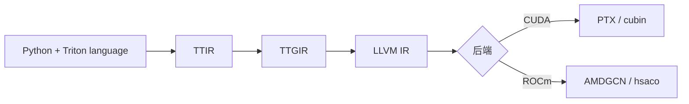
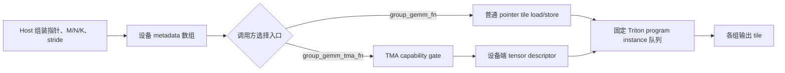

# Triton 官方教程 001–011：从算法到 CUDA 对照实现

本目录保留 Triton 上游提交 `694c0c3bd4da68600ed7028f1be65f72df05a56a` 的 11 个完整 Python 教程，并为每项提供本地 CUDA 教学实现。Python 文件是上游源码的逐字复制；CUDA 文件不是官方实现，也不保证相同 dtype、随机序列、硬件指令或性能。

本文面向第一次接触 GPU kernel 的读者。每项固定按“先决概念 → 算法 → 官方 Triton 实现 → 本地 CUDA 实现 → 动手教程 → 验证现状 → 限制”展开。代码块用于逐构造讲解；从同一实现不同位置抽取的关键行不表示它们在源码中连续相邻。

## 源码地图

| 编号 | 主题 | 官方 Triton | 本地 CUDA |
| --- | --- | --- | --- |
| 001 | Vector Add | [`python/001_vector_add.py`](./python/001_vector_add.py) | [`cuda/001_vector_add.cu`](./cuda/001_vector_add.cu) |
| 002 | Fused Softmax | [`python/002_fused_softmax.py`](./python/002_fused_softmax.py) | [`cuda/002_fused_softmax.cu`](./cuda/002_fused_softmax.cu) |
| 003 | Matrix Multiplication | [`python/003_matrix_multiplication.py`](./python/003_matrix_multiplication.py) | [`cuda/003_matrix_multiplication.cu`](./cuda/003_matrix_multiplication.cu) |
| 004 | Low-Memory Dropout | [`python/004_low_memory_dropout.py`](./python/004_low_memory_dropout.py) | [`cuda/004_low_memory_dropout.cu`](./cuda/004_low_memory_dropout.cu) |
| 005 | LayerNorm Forward/Backward | [`python/005_layer_norm.py`](./python/005_layer_norm.py) | [`cuda/005_layer_norm.cu`](./cuda/005_layer_norm.cu) |
| 006 | Fused Attention Forward/Backward | [`python/006_fused_attention.py`](./python/006_fused_attention.py) | [`cuda/006_fused_attention.cu`](./cuda/006_fused_attention.cu) |
| 007 | External Libdevice Asin | [`python/007_extern_functions.py`](./python/007_extern_functions.py) | [`cuda/007_extern_functions.cu`](./cuda/007_extern_functions.cu) |
| 008 | Grouped GEMM | [`python/008_grouped_gemm.py`](./python/008_grouped_gemm.py) | [`cuda/008_grouped_gemm.cu`](./cuda/008_grouped_gemm.cu) |
| 009 | Persistent/TMA Matmul | [`python/009_persistent_matmul.py`](./python/009_persistent_matmul.py) | [`cuda/009_persistent_matmul.cu`](./cuda/009_persistent_matmul.cu) |
| 010 | Block-Scaled Matmul | [`python/010_block_scaled_matmul.py`](./python/010_block_scaled_matmul.py) | [`cuda/010_block_scaled_matmul.cu`](./cuda/010_block_scaled_matmul.cu) |
| 011 | Programmatic Dependent Launch | [`python/011_programmatic_dependent_launch.py`](./python/011_programmatic_dependent_launch.py) | [`cuda/011_programmatic_dependent_launch.cu`](./cuda/011_programmatic_dependent_launch.cu) |

许可证见 [`LICENSE`](./LICENSE)。

## 共同先决概念

**Operator（算子）**是一条从输入到输出的数学规则。**GPU kernel** 是在 GPU 上执行这条规则的设备函数；**launch** 是 Host 把 kernel 及其参数提交给 GPU。**Tensor** 是有 shape（各维长度）、dtype（元素类型）和存储的多维数据。

### 执行层级和内存

**CUDA thread** 是 CUDA 中执行标量指令的工作单元。32 个 CUDA thread 组成一个 **warp**；一个或多个 warp 组成可共享片上存储并同步的 **CUDA thread block（CTA）**；一次 kernel launch 的全部 CUDA thread block（CTA）组成 **CUDA grid**。

**Triton program instance** 是 Triton launch grid 中的独立程序实例。`tl.program_id(axis)` 返回其编号。**Triton block tensor** 是一个 Triton program instance 同时表达的一组逻辑值。CUDA 中最接近 Triton program instance 的概念是 CUDA thread block（CTA）。二者不是逐 CUDA thread 翻译：编译器会把 Triton block tensor 的逻辑计算映射到物理 warp、lane 和存储。lane 只指 warp 中一个 CUDA thread 的物理位置。

GPU 以 warp 执行 CUDA thread。CUDA `__syncthreads()` 只同步一个 CUDA thread block（CTA）。Global memory（全局内存）是保存输入输出的设备内存；shared memory（共享内存）是 CUDA thread block（CTA）内共享的片上存储；register（寄存器）保存单个 CUDA thread 的私有值。公共文件 [`../../shared/cuda_common.cuh`](../../shared/cuda_common.cuh) 提供 `block_sum`、`block_max`、`ceil_div_int` 和 `CUDA_CHECK`。

二维元素地址由 stride 决定：

$$
\operatorname{addr}(X_{i,j})=X+i\,s_i+j\,s_j.
$$

本文固定使用“行 stride”。stride 以元素为单位。连续行主序矩阵的行 stride 等于列数。

### Tile、fusion 和 persistent kernel

**Tile** 是一次在片上处理的数据块。**Fusion** 把多个数学步骤放入一个 kernel，避免中间结果往返全局内存。**Persistent kernel** 只启动有限数量的 Triton program instance 或 CUDA thread block（CTA），每个执行单元循环领取多个逻辑任务。persistent 描述调度，不表示所有数据永久驻留片上。

Tensor Core 是矩阵乘加硬件。Triton 的 `tl.dot`、`tl.dot_scaled` 可在合适目标上 lowering 到相应指令；本地标量 CUDA 参考不等价。Tensor Memory Accelerator（TMA）是 Hopper 及后续架构的异步张量搬运机制；tensor map 只是描述符，真正的 TMA kernel 还需要异步复制和 barrier。Programmatic Dependent Launch（PDL）允许同一 stream 的后继 CUDA grid 提前取得资源，但消费者仍须在读取依赖数据前等待。

### Triton 和 MLIR

`@triton.jit` 遇到新的参数签名和 meta-parameter 组合时编译 kernel：



TTIR 是高层 MLIR 表示。TTGIR 加入线程、warp、布局和共享内存映射。`num_warps`、`num_stages`、descriptor 和编译提示会影响 lowering，但不是运行时参数校验。

## 001：Vector Add

### 概念与用途

理解一维 Triton launch grid、offset 和 mask。最后一个 Triton program instance 的部分 offset 可能越界，mask 阻止对应逻辑元素访问内存。

### 算法

$$z_i=x_i+y_i,\qquad 0\le i<n.$$

每元素两次读取、一次写入、一次加法，因此通常受内存带宽限制。

Vector Add 没有跨元素依赖，也不包含 backward 教程；这里只比较两种编程模型如何表达同一个前向加法。

### 官方 Triton 实现

```python
pid = tl.program_id(axis=0)
block_start = pid * BLOCK_SIZE
offsets = block_start + tl.arange(0, BLOCK_SIZE)
mask = offsets < n_elements
x = tl.load(x_ptr + offsets, mask=mask)
y = tl.load(y_ptr + offsets, mask=mask)
tl.store(output_ptr + offsets, x + y, mask=mask)
```

`add` 以 `BLOCK_SIZE=1024` 启动。它断言 device，却不完整检查形状、dtype、stride 或元素数。

### 本地 CUDA 实现

```cuda
const int index = blockIdx.x * blockDim.x + threadIdx.x;
if (index < n) out[index] = x[index] + y[index];
```

launcher 固定连续 FP32 和 256 个 CUDA thread，拒绝负 `n` 与非空任务的空指针。

### 动手教程

1. 写出 `n=10`、block size 8 时两个 Triton program instance 的 offset。
2. 标出最后 6 个无效 lane。
3. 比较 Triton 向量表达式与 CUDA 逐 CUDA thread 表达式。

### 验证现状

官方脚本在顶层创建 98432 个元素，打印最大差，并运行 `benchmark.run`。仓库测试只静态检查结构。

### 限制

直接导入会执行示例和 benchmark。本地 CUDA 只支持连续 FP32，并使用 32 位索引。

## 002：Fused Softmax

### 概念与用途

Softmax 需要求行最大值和指数和。稳定形式先减最大值。Persistent 调度让一个 Triton program instance 或 CUDA thread block（CTA）循环处理多行。

### 算法

$$m=\max_jx_j,\qquad y_i=\frac{e^{x_i-m}}{\sum_je^{x_j-m}}.$$

### 官方 Triton 实现

列宽补到下一个 2 的幂，补位以 `-inf` 参与最大值：

```python
row_start = tl.program_id(0)
row_step = tl.num_programs(0)
for row_idx in tl.range(row_start, n_rows, row_step, num_stages=num_stages):
    row = tl.load(input_ptrs, mask=mask, other=-float('inf'))
    numerator = tl.exp(row - tl.max(row, axis=0))
    softmax_output = numerator / tl.sum(numerator, axis=0)
```

wrapper warmup kernel，读取寄存器和共享内存用量，再估算 occupancy。输入与输出使用独立行 stride。

### 本地 CUDA 实现

256 个 CUDA thread 跨列累积，`block_max` 和 `block_sum` 做 CUDA thread block（CTA）归约：

```cuda
for (int row = blockIdx.x; row < rows; row += gridDim.x) {
  const size_t input_base = static_cast<size_t>(row) * input_row_stride;
  const size_t output_base = static_cast<size_t>(row) * output_row_stride;
  // max -> exp sum -> normalized store
  __syncthreads();
}
```

strided 入口要求 `rows>=0`、`cols>0`、`persistent_ctas>0`，并要求两个行 stride 均不小于 `cols`。不支持负 stride。

### 动手教程

1. 用 `[1000,1001]` 比较直接指数和稳定形式。
2. 用 3 行、2 个 CUDA thread block（CTA）写出各自的行序列。
3. 构造带 padding 的行 stride，确认 padding 不参与计算。

### 验证现状

官方脚本以 `(1823,781)` 对比 `torch.softmax`，随后扫描列数 benchmark。静态测试不执行 GPU。

### 限制

本地 CUDA 仅 FP32。launcher 不验证实际 buffer 容量。`row += gridDim.x` 使用 32 位有符号整数；极大 `rows/grid` 可溢出，因此当前实现没有安全的大规模上限。

## 003：Matrix Multiplication

### 概念与用途

输出被划分为二维 tile。每个 tile 沿 K 加载 A/B 子块，并在 FP32 accumulator 中累加。分组 Triton program instance 的顺序提高 B tile 的 L2 复用。

### 算法

$$C_{m,n}=\sum_kA_{m,k}B_{k,n}.$$

可选 epilogue 在写回前执行 leaky ReLU。

### 官方 Triton 实现

`@triton.autotune` 按 `(M,N,K)` 选择 block、warp 和 stage。K 尾部 load 与最终 store 使用 mask。

```python
accumulator = tl.zeros((BLOCK_SIZE_M, BLOCK_SIZE_N), dtype=tl.float32)
for k in range(0, tl.cdiv(K, BLOCK_SIZE_K)):
    a = tl.load(a_ptrs, mask=offs_k[None, :] < K - k * BLOCK_SIZE_K, other=0.0)
    b = tl.load(b_ptrs, mask=offs_k[:, None] < K - k * BLOCK_SIZE_K, other=0.0)
    accumulator = tl.dot(a, b, accumulator)
c = accumulator.to(tl.float16)
```

官方 `matmul` 始终创建 FP16 输出；FP8 输入路径也输出 FP16。

### 本地 CUDA 实现

CUDA 固定 16×16 FP32 shared-memory tile。A、B、C 指针和输出均为 FP32，不是官方 FP16/FP8 Tensor Core 路径。strided 入口要求 `lda>=k`、`ldb>=n`、`ldc>=n`。

```cuda
a_tile[threadIdx.y][threadIdx.x] =
    row < m && a_col < k ? a[static_cast<size_t>(row) * lda + a_col] : 0.0f;
b_tile[threadIdx.y][threadIdx.x] =
    b_row < k && col < n ? b[static_cast<size_t>(b_row) * ldb + col] : 0.0f;
__syncthreads();
for (int inner = 0; inner < kTile; ++inner)
  accumulator += a_tile[threadIdx.y][inner] * b_tile[inner][threadIdx.x];
```

两个条件表达式为边缘 tile 补零。CUDA thread block（CTA）barrier 保证整块载入完成后才开始乘加；`inner` 循环计算一个输出元素在当前 K tile 上的点积。

### 动手教程

1. 手算 2×3 与 3×2。
2. 标出 16×16 tile 的尾部零填充。
3. 比较普通顺序与 `GROUP_SIZE_M` 顺序。

### 验证现状

官方脚本比较 512² FP16，可用时比较 FP8，再运行 benchmark。没有本地 CUDA 数值测试。

### 限制

两条实现输出 dtype 不同。本地 CUDA 无 Tensor Core、FP8 或 autotune。极端 K 仍可能令 32 位循环计数溢出。

## 004：Low-Memory Dropout

### 概念与用途

显式 mask 占用与输入规模相关的内存。Counter-based RNG 可由 seed 和元素 offset 重算随机数，只需保存 seed。

### 算法

$$y_i=\begin{cases}x_i/(1-p),&r_i>p,\\0,&r_i\le p.\end{cases}$$

### 官方 Triton 实现

```python
random = tl.rand(seed, offsets)
x_keep = random > p
output = tl.where(x_keep, x / (1 - p), 0.0)
```

文件先演示显式 int32 mask，再演示 seeded dropout。

### 本地 CUDA 实现

CUDA 提供显式 `bool` mask 与 cuRAND Philox 两个 launcher：

```cuda
curand_init(seed, 0, static_cast<uint64_t>(index), &state);
const bool keep = curand_uniform(&state) > probability;
```

launcher 要求有限的 $0\le p<1$。两种实现均可重算，但不承诺相同 seed 产生相同 mask。

### 动手教程

固定 seed 运行两次，再更换 seed；统计大样本保留率；比较保存 mask 与 seed 的内存量。

### 验证现状

官方脚本只打印 10 个元素的输出。它没有 `perf_report`、benchmark 或统计断言。

### 限制

CUDA mask 是 `bool`，官方示例是 int32。wrapper 对形状、device、mask 长度和 `p` 校验不完整。

## 005：LayerNorm Forward/Backward

### 概念与用途

LayerNorm 对最后一维归一化。前向保存每行 mean 和 reciprocal standard deviation（`rstd`）；反向复用它们，并跨行归约权重、偏置梯度。

### 算法

$$\mu=\frac1N\sum_ix_i,\quad r=\frac1{\sqrt{\frac1N\sum_i(x_i-\mu)^2+\epsilon}},\quad y_i=(x_i-\mu)rw_i+b_i.$$

令 $\hat x_i=(x_i-\mu)r$、$g_i=w_i dy_i$：

$$dx_i=r(g_i-\operatorname{mean}(g)-\hat x_i\operatorname{mean}(g\hat x)).$$

Forward（前向）计算输出；backward（反向）从输出梯度 `dy` 计算输入和参数梯度。参数梯度满足 $dw_i=\sum_r dy_{r,i}\hat{x}_{r,i}$ 和 $db_i=\sum_r dy_{r,i}$。

### 官方 Triton 实现

`LayerNorm` 是 `torch.autograd.Function`。输入 reshape 成二维；特征行受 64 KiB fused-size 上限约束。反向用 `GROUP_SIZE_M` 分组临时 `_dw/_db`，再以第二个 kernel 归约。锁数组前半是 lock、后半是 count；`tl.atomic_cas` 获取锁，`tl.debug_barrier()` 协调 Triton program instance 内执行。

```python
mean = tl.sum(_mean, axis=0) / N
x = tl.where(cols < N, x - mean, 0.)
_var += x * x
var = tl.sum(_var, axis=0) / N
rstd = 1 / tl.sqrt(var + eps)
x = tl.load(X + cols, mask=mask, other=0.).to(tl.float32)
x_hat = (x - mean) * rstd
y = x_hat * w + b
tl.store(Y + cols, y, mask=mask)
```

`tl.sum` 在一个 Triton program instance 内完成行归约。`tl.where` 把 padding 变为零；`rstd` 避免后续重复开方；最后三行融合归一化、仿射变换和写回。

反向不是单个代码片段，而是两阶段数据流：

1. `_layer_norm_bwd_dx_fused` 为每一行重新加载 `x`、`dy`、`w`、mean 和 `rstd`，计算 `xhat`、`wdy`、两项行均值以及 `dx`。
2. 同一 Triton program instance 形成该行的 `partial_dw=dy*xhat` 和 `partial_db=dy`。行号按 `row % GROUP_SIZE_M` 映射到有限数量的临时槽。
3. `tl.atomic_cas` 串行化同槽更新。count 为 0 时直接写第一份 partial；否则先加载旧值再累加。`tl.debug_barrier()` 保证当前 Triton program instance 的逻辑执行者完成存储后才释放锁。
4. `_layer_norm_bwd_dwdb` 沿临时槽维度归约，生成最终 `dw` 和 `db`。因此临时空间与 `GROUP_SIZE_M*N` 成正比，而不是与全部 `M*N` 成正比。

```python
xhat = (x - mean) * rstd
wdy = w * dy
c1 = tl.sum(xhat * wdy, axis=0) / N
c2 = tl.sum(wdy, axis=0) / N
dx = (wdy - (xhat * c1 + c2)) * rstd
partial_dw = (dy * xhat).to(w.dtype)
partial_db = (dy).to(w.dtype)
```

`LayerNorm.backward` 先分配 `_dw/_db` 和 locks，再启动这两个反向 kernel。名为 `Count` 的值实际只是“该临时槽是否已有首个写者”的 0/1 标志，不累计行数。`GROUP_SIZE_M` 随 N 调整，用较少临时槽换取更多锁竞争；这是跨行梯度归约策略，不改变 LayerNorm 数学公式。测试只覆盖连续二维输入；forward 的 X 可经 reshape 复制，但 Y 仍按折叠后的行 stride 寻址，backward 的 X/DY/DX 也复用折叠行 stride，因此 wrapper 没有建立任意非连续布局契约。

### 本地 CUDA 实现

只处理连续二维 FP32。基础 backward 要求 `rows*cols` 个 `partial_dw/partial_db`。grouped backward 的容量契约是：

- `grouped_dw/grouped_db`：至少 `group_size*cols` 个 FP32；
- `locks_and_counts`：至少 `2*group_size` 个 int；
- `dw/db`：至少 `cols` 个 FP32；
- `dx`：至少 `rows*cols` 个 FP32。

grouped kernel 在写 grouped buffer 后执行 `__threadfence()` 和 CUDA thread block（CTA）barrier，再由 CUDA thread 0 解锁，防止其他 CUDA thread block（CTA）过早覆盖。

```cuda
const float mean_value = block_sum(local_sum) / cols;
const float rstd = rsqrtf(block_sum(local_square_sum) / cols + eps);
for (int col = threadIdx.x; col < cols; col += blockDim.x)
  y[row * cols + col] =
      (x[row * cols + col] - mean) * rstd * weight[col] + bias[col];
```

每个 CUDA thread 处理一组列，`block_sum` 合并整个 CUDA thread block（CTA）的部分和。均值和 `rstd` 在 CUDA thread block（CTA）内广播，最后的 grid-stride 列循环写出 FP32 结果。

### 动手教程

1. 手算一行的 mean、rstd 和输出。
2. 推导 `dx` 公式。
3. 比较基础与 grouped 临时空间。
4. 画出两个 CUDA thread block（CTA）竞争同一 lock 的顺序。

### 验证现状

官方脚本调用 `test_layer_norm(1151,8192,float16)` 比较前向与三个梯度，随后运行 backward benchmark。仓库仅静态确认调用存在。

### 限制

CUDA 仅 FP32 连续二维。必须保证 `rows*cols`、`group_size*cols` 不超过 `INT_MAX`。当前 `2*group_size*sizeof(int)` 还存在 32 位中间溢出风险。裸指针 launcher 不能验证容量。

## 006：Fused Attention Forward/Backward

### 概念与用途

Q（query）表示当前位置要查找的信息，K（key）提供匹配特征，V（value）提供被汇入输出的内容。`N_CTX` 是序列长度，`HEAD_DIM` 是每个 attention head 的向量维度。Causal mask 禁止一个 query 读取未来 key。直接保存 $N\times N$ score 需要二次方内存。Online softmax 逐 K/V tile 更新最大值、分母和输出 accumulator，不保存完整 score。

### 算法

$$S=sm\_scale\cdot QK^T,\qquad P=\operatorname{softmax}(S),\qquad O=PV.$$

`sm_scale` 由调用方传入；$1/\sqrt D$ 是常见取值，不是该官方 API 的固定常量。

合并旧状态与新 tile：

$$m'=\max(m,m_t),\quad \alpha=e^{m-m'},\quad l'=\alpha l+\sum_je^{s_j-m'},\quad a'=\alpha a+\sum_je^{s_j-m'}v_j.$$

causal 模式仅允许 key $j\le i$。

### 官方 Triton 实现

官方前向处理 `[batch,head,N_CTX,HEAD_DIM]`，包含 causal、descriptor、autotune 与调用方控制的 warp specialization 分支；反向使用独立 kernel，并不继承全部前向 dtype 和配置能力。wrapper 断言 head dim 属于 `{16,32,64,128,256}`，但当前测试只覆盖 64 和 128，且最小 `BLOCK_N=32` 与 D=16 的候选存在冲突，因此不能把整个集合表述成已验证支持。

FP8 以 `torch.float8_e5m2` 为开关；V 有转置语义，输出由 `FP8_OUTPUT` 控制。host descriptor 仅 CUDA capability 9+。这不表示任意 GPU 或任意 FP8 dtype 均受支持。`sm_scale` 是 API 参数；常用值是 `1/sqrt(HEAD_DIM)`。反向要求 Q/K/V/O/dO stride 相同。

```python
qk = tl.dot(q, k)
qk = qk * qk_scale + tl.where(mask, 0, -1.0e6)
m_ij = tl.maximum(m_i, tl.max(qk, 1))
qk -= m_ij[:, None]
p = tl.math.exp2(qk)
alpha = tl.math.exp2(m_i - m_ij)
acc = acc * alpha[:, None]
p = p.to(dtype)
acc = tl.dot(p, v, acc)
```

`tl.dot` 形成 score tile，mask 屏蔽不可见位置。`m_ij`、`alpha` 和 `p` 实现 online softmax 状态更新，第二个 `tl.dot` 把概率 tile 与 V 融合到 accumulator。

调用方显式传入 `warp_specialize`；wrapper 根据目标能力以及 Hopper 与 warp-specialization 的组合选择 Host 或 Device descriptor；autotuner 再选择 tile、`num_warps` 和 `num_stages`。`_attn_fwd_inner` 的 `STAGE` 把 causal 计算拆为对角线左侧的非 mask 区和对角块的 mask 区；非 causal 路径遍历完整 K/V。前向把 score scale 乘 $1/\ln 2$ 后使用 `exp2`，并保存 base-2 状态 `M=m_i+log2(l_i)` 供反向重构概率。本地 CUDA 保存自然对数 `running_max+log(running_sum)`；两者数学等价，但缓冲区编码不能互换。

反向由 preprocess 和主 kernel 组成：

```python
delta = tl.sum(o * do, axis=1)
ppT = pT
ppT = ppT.to(tl.float16)
dv += tl.dot(ppT, do)
dpT = tl.dot(v, tl.trans(do)).to(tl.float32)
dsT = pT * (dpT - Di[None, :])
dsT = dsT.to(tl.float16)
dk += tl.dot(dsT, tl.trans(qT))
```

`_attn_bwd_preprocess` 先计算每个 query 行的 $\delta_i=\sum_d O_{i,d}\,dO_{i,d}$。`_attn_bwd_dkdv` 固定 K/V tile 并遍历 Q/dO，拥有对应 dK/dV tile 的写权限；`_attn_bwd_dq` 固定 Q/dO tile 并遍历 K/V，拥有对应 dQ tile 的写权限。Causal 模式分别处理对角 mask 段和非对角段。主 `_attn_bwd` 对 softmax 的 base-2 缩放与 `sm_scale` 做预缩放和最终反缩放。反向要求 `dO` contiguous、Q/K/V/O/dO 的 stride 完全相同、`N_CTX` 是 128 的倍数，并且不支持 FP8 backward。

### 本地 CUDA 实现

单头 FP32 forward 每 query 一个 CUDA thread block（CTA），K/V tile 为 32。scale 固定为：

```cuda
const float scale = 1.0f / std::sqrt(static_cast<float>(dim));
```

所以 CUDA 不接受自定义 scale 或 stride。单头 backward 用 `atomicAdd` 合并 dK/dV。batched 扩展提供连续 FP32/FP16 forward；FP16 是 IEEE half，不是 FP8。staged backward 仅 FP32，依次执行 delta、dQ、dK/dV 三个 kernel。

### 动手教程

1. 手算两个 tile 的 online recurrence。
2. 标出 causal 可见区域。
3. 推导 $\delta_i=\sum_dO_{i,d}dO_{i,d}$ 与 $dS=P\odot(dP-\delta)$。
4. 比较 atomic 与 staged 写所有权。

### 验证现状

`test_op` 是 pytest 参数化函数；直接执行脚本只运行 `bench_flash_attention.run`。benchmark 比较 Triton FP16、前后向与 causal 组合；只有 forward 会把输入转换为 FP8，backward 的 `triton-fp8` provider 实际仍使用 FP16。benchmark 不测试本地 CUDA。

### 限制

CUDA scale 固定且布局连续。FP16 动态共享内存受每个 CUDA thread block（CTA）的设备上限约束。多处 `query*dim/key*dim/row*dim` 使用 32 位 int，相关乘积必须不超过 `INT_MAX`。Atomic 浮点累加不保证逐位复现。官方 forward 的 M/O 写回和 descriptor K/V load 没有任意 `N_CTX` 尾块安全契约，现有测试与 benchmark 使用 128 的倍数。本地 staged backward 的 dQ 和 dK/dV 对每个输出维重复长度 D 的 score/dP 点积，渐进工作约为 $O(BHN^2D^2)$，远高于 tiled FlashAttention backward 的主算量。CUDA 路径是数学教学参考，不是 FlashAttention 性能实现。

## 007：External Libdevice Asin

### 概念与用途

Device function 是 GPU kernel 可调用、但不独立 launch 的函数。NVIDIA libdevice 和 AMD OCML 等 device library 提供 `asin` 这类数学函数。LLVM bitcode 是编译器可读的中间代码；`extern_libs` 把它作为编译/链接输入合入 GPU 程序，不是运行时动态加载共享库。Triton 的 `libdevice.asin` 会根据 Triton dtype 选择底层实现；本例输入是 FP32，因此 CUDA 对照调用单精度 `asinf`。

### 算法

$$y_i=\arcsin(x_i).$$

### 官方 Triton 实现

```python
x = tl.load(x_ptr + offsets, mask=mask)
x = libdevice.asin(x)
tl.store(y_ptr + offsets, x, mask=mask)
```

脚本没有单独 wrapper：顶层代码以 `ceil(n/1024)` 个 Triton program instance 启动同一个 kernel。第一次使用后端默认 device library；第二次只通过 `extern_libs` 改变编译/链接输入。数据流是 `FP32 input -> libdevice.asin -> FP32 output`。

### 本地 CUDA 实现

每个连续 FP32 元素调用 `asinf`。

```cuda
const int index = blockIdx.x * blockDim.x + threadIdx.x;
if (index < n) out[index] = asinf(x[index]);
```

线性索引把一个元素分给一个 CUDA thread；边界条件保护最后一个 CUDA thread block（CTA）；`asinf` 是 CUDA 单精度 device 数学函数。

### 动手教程

先运行默认路径；打印自定义路径并用 `Path.exists()` 检查；测试 0、1 和接近 1 的输入。

### 验证现状

复制后的代码仍计算：

```python
libdir = current_dir.parent.parent / 'third_party/nvidia/backend/lib'
```

它现在指向不存在的 `triton-100-ops/categories/third_party/...`。CUDA 的 libdevice 与 HIP 的 OCML 两条显式相对路径在搬移后都不存在。默认路径可能工作；第二次显式 `extern_libs` 调用会在编译/链接阶段失败，这不是 `asin` 数学计算错误。

### 限制

本文只记录坏路径，不修改官方副本。可靠修复需随项目打包 bitcode、查询已安装 backend 路径，或移除失效的搬移示例。`asin` 的实数输入域是 $[-1,1]$；现有随机输入只覆盖 `[0,1)`，没有覆盖负数、域外 NaN 或特殊值。007 没有官方 benchmark。

## 008：Grouped GEMM

### 概念与用途

Host 把多组 A/B/C 指针、`(M,N,K)` 和行 stride 放入 device 数组。有限数量的 worker CUDA thread block（CTA）在所有组拼接的逻辑 tile 队列中前进。

### 算法

$$C^{(g)}=A^{(g)}B^{(g)}.$$

第 $g$ 组 tile 数为 $\lceil M_g/B_M\rceil\lceil N_g/B_N\rceil$。

### 官方 Triton 实现

普通 pointer-list kernel 把指针转为 `tl.float16`，以 FP32 累加后写 FP16。源码明确“assume full tile”，load/store 没有 M/N/K mask，因此示例形状必须是所选 tile 的完整倍数。

TMA kernel 以 `tl.float8e4nv if FP8 else tl.float16` 选择类型。FP8 只属于条件 TMA 路径。`group_gemm_fn` 构造 device pointer 与 int32 metadata；TMA wrapper 还安装 allocator。

普通路径与 TMA 路径共享“把所有组的输出 tile 拼成一条全局队列，再让固定数量的 Triton program instance 跨步领取任务”的调度。差别在数据访问：普通路径从指针和 stride 计算每个元素地址；TMA 路径在设备端用 `tl.make_tensor_descriptor` 建立 A/B/C descriptor，并通过 descriptor 的 block load/store 搬运 tile。TMA wrapper 要求 B 以 `[N,K]` 转置布局提供，而普通 wrapper 接收 `[K,N]`；两条接口不能只替换 kernel 名称。



```python
tile_idx = tl.program_id(0)
while (tile_idx >= last_problem_end and tile_idx < last_problem_end + num_tiles):
    tile_idx_in_gemm = tile_idx - last_problem_end
    tile_m_idx = tile_idx_in_gemm // num_n_tiles
    tile_n_idx = tile_idx_in_gemm % num_n_tiles
    accumulator += tl.dot(a, b)
    tile_idx += NUM_SM
```

Triton program instance 从自身编号开始。区间减法把全局 tile 变成组内 tile，商和余数得到二维坐标；每完成一个 tile 就跨过 `NUM_SM` 领取下一项。

### 本地 CUDA 实现

固定 FP32、16×16 tile，并处理尾部。`workers` 是 CUDA grid 中 worker CUDA thread block（CTA）的数量，不是 SM ID，也不保证一个 worker 固定绑定某个物理 SM。全局 `tile` 不在组间重置：

```cuda
int64_t tile = blockIdx.x;
int64_t problem_begin = 0;
for (int group = 0; group < groups; ++group) {
  const int64_t problem_end =
      problem_begin + static_cast<int64_t>(tiles_m) * tiles_n;
  for (; tile >= problem_begin && tile < problem_end; tile += workers) {
    const int local = static_cast<int>(tile - problem_begin);
    const int row = (local / tiles_n) * kTile + threadIdx.y;
    const int col = (local % tiles_n) * kTile + threadIdx.x;
  }
  problem_begin = problem_end;
}
```

### 动手教程

为两组 GEMM 列出拼接 tile 区间；令 workers=3 写出每个 CUDA thread block（CTA）的任务；比较 Triton full-tile 与 CUDA 尾部保护。

### 验证现状

官方脚本顶层验证四组 FP16，条件验证 TMA，再运行两组 benchmark。静态测试不启动 kernel。

### 限制

CUDA launcher 不能从 host 验证 device metadata 中的负维度、stride 或成员空指针。调用方必须保证每组有效。`row*stride` 使用 32 位 int，offset 必须不超过 `INT_MAX`。普通 Triton kernel 不支持 partial tile。

## 009：Persistent/TMA Matmul

### 概念与用途

Persistent scheduling 决定 CUDA thread block（CTA）如何领取 tile；TMA 决定数据搬运。两者相互独立。

### 算法

数学仍是 $C=AB$。Persistent Triton launch grid 以不超过 `NUM_SMS` 的 Triton program instance 循环处理输出 tile。

### 官方 Triton 实现

文件提供普通 pointer、普通 TMA、persistent pointer、persistent TMA 和 device-descriptor persistent 五类 kernel。普通版本让 Triton launch grid 覆盖逻辑 tile；persistent 版本把 Triton program instance 数限制在 `min(NUM_SMS, num_tiles)`，每个实例以 `NUM_SMS` 为步长循环领取多个 tile。`num_stages` 是软件流水深度，不是算法阶段数；更多 stage 也会消耗更多资源。

```python
for tile_id in tl.range(start_pid, num_tiles, NUM_SMS, flatten=True):
    pid_m, pid_n = _compute_pid(tile_id, num_pid_in_group, num_pid_m, GROUP_SIZE_M, NUM_SMS)
    for ki in range(k_tiles):
        accumulator = tl.dot(a, b, accumulator)
```

每个 Triton program instance 以 `NUM_SMS` 为步长领取 tile。`_compute_pid` 应用 grouped-M 顺序；K 循环累加完整 tile 后再领取下一任务。

五条路径的职责如下：

| 路径 | B 的输入布局 | Tile 搬运 | 任务调度 | Descriptor 创建位置 |
|---|---|---|---|---|
| `matmul_kernel` | `[K,N]` | pointer + mask | 普通 Triton launch grid | 不使用 |
| `matmul_kernel_tma` | `[N,K]` | TMA descriptor | 普通 Triton launch grid | Host wrapper |
| `matmul_kernel_persistent` | `[K,N]` | pointer + mask | persistent | 不使用 |
| `matmul_kernel_tma_persistent` | `[N,K]` | TMA descriptor | persistent | Host wrapper |
| `matmul_kernel_descriptor_persistent` | `[N,K]` | TMA descriptor | persistent | GPU kernel 内 |

TMA 解决二维 tile 的异步搬运描述；persistent 解决 Triton program instance 如何重复领取 tile；warp specialization 允许不同 warp 承担不同流水职责；epilogue subtiling 把输出 accumulator 拆成两半存储，以减少 epilogue 的 shared-memory 压力。四个概念彼此相关但不等价。这里的异步 warp scheduling 当前只用于 Blackwell；旧目标走 software pipelining。官方 benchmark 与 `validate` 会跳过 Hopper 上的 Host-descriptor + warp-specialization 组合，并改测 device-descriptor 路径；这不是 `matmul_tma(..., True)` wrapper 内部的硬拒绝。源码还会过滤部分 epilogue/flatten 组合，并由 autotune 在合法候选中选择配置。

### 本地 CUDA 实现

naive 与 persistent 都是 16×16 FP32 shared-memory GEMM：

```cuda
for (int tile = blockIdx.x; tile < tiles_m * tiles_n; tile += gridDim.x) {
  int tile_m = 0;
  int tile_n = 0;
  op009_grouped_tile_coordinates(
      tile, tiles_m, tiles_n, &tile_m, &tile_n);
  const int row = tile_m * kTile + threadIdx.y;
  const int col = tile_n * kTile + threadIdx.x;
}
```

`op009_encode_tma_tensor_map_2d` 在 CUDA 12+ 调用真实 Driver API `cuTensorMapEncodeTiled`。但没有本地 kernel 消费 descriptor，也没有 TMA copy 或 mbarrier；它不是 TMA GEMM。

### 动手教程

比较 naive 和 persistent block 数；追踪一个 CUDA thread block（CTA）的多个 tile；单独测试 descriptor 错误；在官方源码中分离 pointer/TMA/persistent 开关。

### 验证现状

官方脚本先 `validate`，再以 Proton 分析 precision 和 K 范围。`validate` 只计算 `torch.allclose(..., atol=1.0)`、生成图标并打印，不会在失败时触发 assert；它是打印式检查，不是自动测试通过证明。本地 CUDA 无运行 harness。

### 限制

CUDA 仅连续 FP32。tile 数检查不等于元素索引安全；`row*k/b_row*n/row*n` 均为 32 位 int，offset 必须不超过 `INT_MAX`。更多 stage 不保证更快。

## 010：Block-Scaled Matmul

### 概念与用途

Block scaling 让沿 K 的一组低精度元素共享 scale。FP4 E2M1 用 1 个符号位、2 个指数位和 1 个尾数位表示一个 4-bit 元素；一个 byte 打包两个 FP4。FP8 E4M3FN 用 4 个指数位和 3 个尾数位表示 8-bit 元素；E8M0 只有指数，常保存 Microscaling（MX）scale。Descriptor 描述多维 tensor 的 shape、stride 和 block shape。NVIDIA 路径通过 TensorDescriptor 搬运 tile；AMD CDNA4 kernel 使用裸 pointer 和 `tl.load`，不使用 descriptor 或 TMA。

### 算法

令 $g(k)=\lfloor k/V\rfloor$：

$$C_{m,n}=\sum_k(A_{m,k}s^A_{m,g(k)})(B_{k,n}s^B_{n,g(k)}).$$

Scale B 按逻辑 `[N,K/V]`，因为低精度 RHS 以 `[N,K]` 形式提供。

### 官方 Triton 实现

NVIDIA kernel 用 descriptor 加载 packed operand 和五维 scale，再 reshape/transpose：

```python
scale_a = scale_a.reshape(rep_m, rep_k, 32, 4, 4).trans(0, 3, 2, 1, 4).reshape(BLOCK_M, BLOCK_K // VEC_SIZE)
if MIXED_PREC:
    accumulator = tl.dot_scaled(a, scale_a, "e4m3", b.T, scale_b, "e2m1", accumulator)
elif ELEM_PER_BYTE_A == 2 and ELEM_PER_BYTE_B == 2:
    accumulator = tl.dot_scaled(a, scale_a, "e2m1", b.T, scale_b, "e2m1", accumulator)
else:
    accumulator = tl.dot_scaled(a, scale_a, "e4m3", b.T, scale_b, "e4m3", accumulator)
```

Gate 是 CUDA major 10/11 或 AMD `gfx950`。格式为 `nvfp4/mxfp4/mxfp8/mixed`。`nvfp4` vector size 16，其余初始化路径为 32。FP4 沿 K 每 byte 两元素。NVIDIA scale 形状要求 M/N 为 128 倍数，且 K/vector size 可按 4 分组。AMD 路径仅 `mxfp4`，使用独立 CDNA4 preshuffle。

| 格式 | A | B | Scale | 每组 K 元素 | 官方后端 |
|---|---|---|---|---:|---|
| `nvfp4` | packed E2M1 | packed E2M1 | E4M3FN | 16 | NVIDIA |
| `mxfp4` | packed E2M1 | packed E2M1 | E8M0 | 32 | NVIDIA、AMD `gfx950` |
| `mxfp8` | E4M3FN | E4M3FN | E8M0 | 32 | NVIDIA |
| `mixed` | E4M3FN | packed E2M1 | E8M0 | 32 | NVIDIA |

NVIDIA wrapper 先把逻辑 scale `[outer, K/V]` 预排成 `[outer/128, groups/4, 32, 4, 4]`，descriptor 再按五维 block 加载。kernel 把 scale reshape、transpose 后恢复为 `tl.dot_scaled` 需要的二维 `[BLOCK_M, BLOCK_K/V]` 或 `[BLOCK_N, BLOCK_K/V]`。AMD 只走 `mxfp4`，根据 MFMA 非 K 维大小预先 shuffle scale，再在 CDNA4 kernel 中重建布局。

```text
逻辑 [outer, group]
  → [outer_chunk, k_chunk, lane, quartet, within_k]
  → 物理 [outer/128, groups/4, 32, 4, 4]
```

### 本地 CUDA 实现

这是 FP32 数学参考，不使用 Tensor Core、tcgen05 或 MFMA。输出和 scale 均 FP32。解码后 FP32 入口把 B 解释为 `[K,N]`；packed FP4、FP8 byte 和 mixed reference 把 B 解释为 `[N,K]`。`scale_layout=0` 是行主序；`scale_layout=1` 是教程 packed NVIDIA layout，要求 M/N 为 128 倍数、groups 为 4 倍数。

```cuda
const int group = inner / vec;
accumulator +=
    (a[row * k + inner] * scale_a[row * groups + group]) *
    (b[inner * n + col] * scale_b[col * groups + group]);
c[row * n + col] = accumulator;
```

整数除法选择当前 K 元素所属的 scale group。A 使用按行 scale，B 使用按输出列 scale；两侧反量化后的值相乘并累加到 FP32 输出。四个本地 launcher 分别覆盖已解码 FP32、packed FP4、FP8 byte 和 mixed 输入。后三者用 `[N,K]` 或 `[N,K/2]` 保存 B；FP4 以 K 的奇偶选择低/高 4-bit。`scale_layout=1` 只复现 NVIDIA packed scale 的地址顺序，scale 元素仍是 FP32，不解码官方 E8M0/E4M3FN scale，也不使用 TMA 或原生 scaled MMA。

### 动手教程

解码 E2M1；用小 vector size 追踪 scale；跟踪一个 128×4 packed scale block；区分 operand 编码、scale 编码和 accumulator dtype。

### 验证现状

官方脚本先做 hardware gate，支持时固定验证 8192³。`--bench` 使用 `store_true` 但默认也是 `True`，无法靠省略 flag 关闭；测量默认重复 10000 次。运行前应评估资源和时长。本地 CUDA 无自动数值测试。

### 限制

CUDA FP8 decoder 是 E4M3FN。`scale_layout=1` 复现 packed scale 的地址排列，但 scale 值已解码为 FP32；它不复现 E8M0/E4M3FN scale 编码、TMA 或原生 scaled 指令。复杂度为标量 $O(MNK)$。矩阵、packed pitch 与 scale offset 使用 32 位 int，所有 offset 必须不超过 `INT_MAX`。整除检查不验证 buffer 容量。

## 011：Programmatic Dependent Launch

### 概念与用途

PDL 允许同 stream 的后继 CUDA grid 提前调度。GDC wait 保护消费者读取；launch-dependents trigger 允许后继开始争取资源。trigger 本身不提供额外内存排序。

### 算法

算子仍是向量加法，重点是 launch 协议。

### 官方 Triton 实现

```python
if USE_GDC:
    tl.extra.cuda.gdc_wait()
x = tl.load(x_ptr + offsets, mask=mask)
y = tl.load(y_ptr + offsets, mask=mask)
if USE_GDC:
    tl.extra.cuda.gdc_launch_dependents()
```

launch 同时传入编译期 `USE_GDC` 与运行时 `launch_pdl`。脚本 gate 只检查 CUDA backend 和 capability major >=9。

### 本地 CUDA 实现

Device 调用只在 `__CUDA_ARCH__>=900` 编译；host PDL 路径要求 `CUDART_VERSION>=12000`，运行时再检查 device major >=9，并设置 `cudaLaunchAttributeProgrammaticStreamSerialization`。三个 gate——toolkit API、SM90+ device code、运行设备——必须同时成立。

```cuda
#if defined(__CUDA_ARCH__) && __CUDA_ARCH__ >= 900
  if (enable_pdl) cudaGridDependencySynchronize();
#endif
if (index < n) { xv = x[index]; yv = y[index]; }
#if defined(__CUDA_ARCH__) && __CUDA_ARCH__ >= 900
  if (enable_pdl) cudaTriggerProgrammaticLaunchCompletion();
#endif
if (index < n) out[index] = xv + yv;
```

wait 位于依赖读取前。CUDA thread 先把输入读入寄存器，再触发 dependents；最终加法和写回可与后继 CUDA grid 的非依赖工作重叠。预处理条件保证旧架构不会编译这些 device API。

### 动手教程

先禁用 PDL 验证加法；打印 backend/runtime/capability；提交成对前驱和后继；用 profiler 观察 overlap。

### 验证现状

官方 validate 使用 `torch.allclose(..., atol=1.0)`。输入位于 `[0,1)` 时该容差过宽，漏加一个输入也可能通过。benchmark 用 CUDA Graph 比较同一个单 kernel 的 PDL 开关，不能证明跨 CUDA grid overlap。

### 限制

Python gate 不检查 toolkit/runtime。构建必须包含 SM90+ code。当前验证应改用严格 FP32 容差，但本目录不修改官方副本。没有成对 workload 时，PDL 性能结论有限。

## 运行和验证

需要与 GPU 匹配的 PyTorch、Triton 和 CUDA/ROCm backend。CUDA `.cu` 文件没有统一 CMake、公开 header 或可执行 harness，不能仅凭 README 独立链接运行。

从 `triton-100-ops` 根目录运行官方脚本：

```shell
python3 categories/01_official_tutorials/python/001_vector_add.py
python3 categories/01_official_tutorials/python/006_fused_attention.py
python3 categories/01_official_tutorials/python/009_persistent_matmul.py -K 512 --prec fp16
python3 categories/01_official_tutorials/python/011_programmatic_dependent_launch.py
```

001–005、007、008 含顶层执行代码。006、009、010、011 保护部分 main 入口。007 的显式 extern-lib 路径已知失效；010 默认 benchmark 很重。

静态验证命令：

```shell
python3 tests/test_01_official_tutorials.py
python3 tests/test_catalog_static.py
```

这些测试解析源码并检查文件、符号和机制。它们不会 JIT Triton、编译 CUDA、运行 GPU 或比较本地 CUDA 数值。

每条 GPU 路径至少应覆盖最小形状、整除/非整除 tile、空输入、padded stride、dtype/device 错误、大索引、架构 gate、同步后的 launch error，以及明确的 `atol/rtol`。裸指针 launcher 不能验证分配大小；调用方必须按契约分配，并在 debug 环境使用 Compute Sanitizer。

性能测试应先预热 JIT/autotune，并分别报告 kernel 时间、metadata/descriptor 构造、packing、dtype、GPU、版本和统计量。不要把数学参考 CUDA 与硬件专用 Triton吞吐直接比较，也不要从单 kernel 延迟推断 PDL overlap。

## 已知集成状态

| 范围 | 当前事实 |
| --- | --- |
| 官方 Python 001–011 | 与记录的上游提交逐字复制；不为新目录直接改写 |
| 本地 CUDA 001–011 | 每项独立 `.cu` 和 launcher；无统一运行 harness |
| 公共 CUDA helper | include 指向现有 `shared/cuda_common.cuh` |
| 007 extern libs | 搬移后相对路径失效 |
| CUDA 大索引 | 005、006、008、009、010 等含 32 位乘法，调用方必须限制规模 |
| GPU 自动测试 | 当前是静态检查，不构成运行时正确性证明 |
| benchmark | 各官方脚本自行拥有；004、007 没有官方 benchmark |

建议学习顺序是 001 索引、002 归约、003 tile、004 RNG、005 梯度、006 online softmax、007 链接、008/009 persistent 调度、010 低精度布局、011 跨 CUDA grid 协议。
