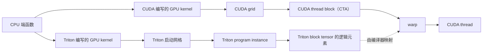

# 061–068：视觉算子

**算子（operator）**是对张量执行一种确定计算的函数。**CPU（中央处理器）**负责运行 Python 入口和发起计算，**GPU（图形处理器）**用大量执行单元并行处理张量元素。

本章通过八个可直接阅读的算子讲清卷积、池化和图像缩放。每个算子都有两条实现路径：Triton 是嵌入 Python 的 GPU 编程语言和编译器；编译器把源代码转换成 GPU 可执行代码。CUDA 是 NVIDIA 提供的 GPU 编程平台与执行模型。Python 入口使用 PyTorch；PyTorch 是负责创建张量、管理设备和提供参考算子的深度学习框架。GPU kernel 是由 CPU 发起、在 GPU 上并行执行的函数。代码以教学为目标，不替代 cuDNN。cuDNN 是 NVIDIA 针对深度学习算子优化的生产库。

## 学习目标

完成本章后，你应当能够：

1. 根据张量形状计算两种内存布局的线性地址。
2. 区分 GPU 上执行的函数、卷积的数值权重和空间尺寸。
3. 推导卷积与池化的输出尺寸。
4. 说明两种编程模型如何把输出工作映射到 GPU。
5. 判断连续访问、数据复用和归约方式如何影响 GPU 性能。

## 先理解基础概念

### 张量、形状和数据类型

**张量（tensor）**是按多个维度组织的一段数据。**形状（shape）**给出每个维度的长度。例如，形状 $[2,3,5,7]$ 表示张量有四个维度，共有 $2\times3\times5\times7$ 个元素。

本章使用两种布局：

| 布局 | 维度 | 含义 | 最内层连续维度 |
| --- | --- | --- | --- |
| NCL | $[N,C,L]$ | 批次、通道、序列长度 | $L$ |
| NCHW | $[N,C,H,W]$ | 批次、通道、高度、宽度 | $W$ |

$N$ 是一次处理的样本数。$C$ 是每个位置保存的特征通道数。$L$ 是一维信号长度，$H$ 和 $W$ 是二维图像的高度和宽度。

本章要求张量采用**连续内存布局**。这表示最后一个维度变化最快，逻辑上相邻的元素按固定顺序存放。NCL 坐标 $(n,c,l)$ 的线性下标为：

$$
(nC+c)L+l
$$

NCHW 坐标 $(n,c,h,w)$ 的线性下标为：

$$
((nC+c)H+h)W+w
$$

**数据类型（dtype）**决定每个元素的表示方式。FP 表示 floating point（浮点数）；FP16、BF16 和 FP32 分别是 16 位、16 位和 32 位浮点格式。FP16 和 BF16 占用较少显存；FP32 通常提供更高的累加精度。本章的 Triton 实现会在累加多个值时把输入值转换成 FP32。

### GPU kernel 与卷积核不是同一概念

本文固定使用以下名称：

- **GPU kernel**：由 CPU 发起、在 GPU 上并行执行的函数。源代码标识符中的 `_kernel` 保持原名。
- **卷积核权重**：卷积算子学习到的数值张量，例如 $[C_{out},C_{in},K_h,K_w]$。
- **卷积核尺寸**：卷积核权重在空间维度上的大小，例如 $K_h\times K_w$。
- **池化窗口尺寸**：池化读取的局部区域大小。代码参数 `kernel` 和标识符 `KERNEL_HEIGHT` 是源码名称；正文不把它们简称为 kernel。

这样可以避免把“在 GPU 上运行的函数”和“卷积使用的权重窗口”混为一谈。

### 卷积、池化和插值

深度学习框架通常把**互相关（cross-correlation）**称为卷积。互相关让一个局部窗口与卷积核权重逐项相乘再求和，但不会翻转卷积核权重。本章的 061–064 都实现互相关语义。

**偏置（bias）**是每个输出通道额外加上的一个数。**输入通道** $C_{in}$ 表示每个输入位置的特征数，**输出通道** $C_{out}$ 表示要生成的特征数。

**池化（pooling）**不使用可训练权重。最大池化从局部窗口中选最大值，平均池化计算局部窗口的平均值。

**插值（interpolation）**从输出坐标反推输入坐标。最近邻缩放复制一个输入像素；双线性缩放读取四个输入像素并计算加权和。

### 步幅、填充和输出尺寸

**步幅（stride）** $S$ 表示相邻输出窗口在输入上移动多少个位置。**填充（padding）** $P$ 表示在输入两侧逻辑补多少个位置。本章的卷积和池化使用相同的标量步幅与填充，因此高度和宽度共用同一个设置。

对于输入尺寸 $I$、卷积核尺寸或池化窗口尺寸 $K$，输出尺寸 $O$ 为：

$$
O=\left\lfloor\frac{I+2P-K}{S}\right\rfloor+1
$$

其中 $\lfloor x\rfloor$ 表示向下取整。实现要求 $I+2P\ge K$。二维算子分别对高度和宽度应用该公式。

以一维输入为例，$I=5$、$K=3$、$S=2$、$P=1$ 时：

```text
逻辑输入:  [P, x0, x1, x2, x3, x4, P]
窗口 0:    [P, x0, x1]
窗口 1:            [x1, x2, x3]
窗口 2:                    [x3, x4, P]
```

这里的 `P` 表示填充位置，不是实际存入显存的元素。GPU kernel 用边界判断和掩码让这些位置贡献 0 或负无穷。

### 并行执行模型

CPU 端函数先检查参数、创建输出张量，再启动 GPU kernel。CUDA 和 Triton 描述并行工作的方式不同。

- `CUDA grid` 是一次 GPU kernel 启动的全部 `CUDA thread block（CTA）`。
- 一个 `CUDA thread block（CTA）` 包含多个 `CUDA thread`，并由一个流式多处理器（SM）调度。
- NVIDIA GPU 通常以 32 个 `CUDA thread` 组成一个 warp 并执行同一条指令。
- Triton 启动网格包含多个 `Triton program instance`。
- 一个 `Triton program instance` 操作一个或多个 `Triton block tensor`。`Triton block tensor` 的逻辑元素由编译器映射到硬件执行资源，不能把一个逻辑元素固定等同于一个 `CUDA thread`。



`tl.program_id(0)` 标识当前 `Triton program instance`。`tl.arange` 生成 `Triton block tensor` 的一组逻辑下标。CUDA 中的 `blockIdx.x`、`blockDim.x` 和 `threadIdx.x` 共同计算当前 `CUDA thread` 的全局下标。

### 掩码、归约和编译期循环

**掩码（mask）**是布尔条件。`tl.load` 和 `tl.store` 使用掩码跳过越界地址。掩码为假时，masked load 可用 `other` 指定替代值。

**归约（reduction）**把多个值合成一个值，例如求和或求最大值。`tl.sum` 和 `tl.max` 会归约 `Triton block tensor` 的逻辑元素。CUDA 对照实现则让一个 `CUDA thread` 用普通循环串行累加。

Triton 中标记为 `tl.constexpr` 的参数在编译 GPU kernel 时已知。因此，卷积核尺寸上的 Python `range` 会成为编译期循环。尺寸越大，编译代码和执行工作量通常也越大。

### GPU 存储和性能术语

GPU 全局内存容量大但延迟高。寄存器位于执行单元附近，速度快但数量有限。共享内存由同一 `CUDA thread block（CTA）` 内的 `CUDA thread` 协作使用。硬件高速缓存会自动保留近期读取的数据。

相邻 `CUDA thread` 访问相邻地址时，硬件通常可以合并显存事务，这称为**合并访问**。多个输出重复读取同一输入或卷积核权重时，可以通过共享内存或高速缓存实现**数据复用**。每读取一个字节能完成的运算越多，**算术强度**越高；算术强度低的算子更容易受显存带宽限制。

**GEMM（general matrix multiplication，通用矩阵乘法）**计算两个矩阵的乘积。**隐式 GEMM** 不一定先创建完整矩阵，而是把卷积的读取与归约组织成矩阵乘的数据块。**Tensor Core** 是 GPU 中为矩阵乘加设计的专用单元。当前八个实现都没有使用共享内存数据块、隐式 GEMM 或 Tensor Core。

## 文件和公共接口

| 编号 | 算子 | Triton 实现 | CUDA 实现 |
| --- | --- | --- | --- |
| 061 | Conv1D | [Python](python/061_conv1d.py) | [CUDA](cuda/061_conv1d.cu) |
| 062 | Conv2D | [Python](python/062_conv2d.py) | [CUDA](cuda/062_conv2d.cu) |
| 063 | Depthwise Conv2D | [Python](python/063_depthwise_conv2d.py) | [CUDA](cuda/063_depthwise_conv2d.cu) |
| 064 | Pointwise Conv2D | [Python](python/064_pointwise_conv2d.py) | [CUDA](cuda/064_pointwise_conv2d.cu) |
| 065 | MaxPool2D | [Python](python/065_max_pool2d.py) | [CUDA](cuda/065_max_pool2d.cu) |
| 066 | AvgPool2D | [Python](python/066_avg_pool2d.py) | [CUDA](cuda/066_avg_pool2d.cu) |
| 067 | Nearest Resize | [Python](python/067_nearest_resize.py) | [CUDA](cuda/067_nearest_resize.cu) |
| 068 | Bilinear Resize | [Python](python/068_bilinear_resize.py) | [CUDA](cuda/068_bilinear_resize.cu) |

Python 入口接收同一设备、相同数据类型且连续的 PyTorch 张量。这里的设备表示实际保存和计算张量的 GPU。设备可以使用 CUDA（NVIDIA GPU 软件栈）或 PyTorch 支持的 ROCm（AMD GPU 软件栈）。浮点输入支持 FP16、BF16 和 FP32。061–066 返回 FP32；067–068 保留输入数据类型。

CUDA 文件提供独立的对照实现。它们的接口使用 `float*`；该指针指向一串 FP32 元素，因此只覆盖 FP32。CUDA 启动函数通过 `cudaError_t` 返回错误状态。本仓库的 Python 测试和性能基准（benchmark）程序不会编译或调用这些 CUDA 文件。

Python 公共代码负责张量检查、输出尺寸计算、卷积核尺寸或池化窗口尺寸转换，以及归约宽度选择。CUDA 公共代码只检查部分空间参数和输出元素总数。两条路径的参数检查并不完全等价。

## 整数和地址限制

CUDA 061–068 主要使用 32 位有符号 `int` 计算坐标和线性地址。`total_fits` 只证明输出元素总数不超过 `INT_MAX`，不能证明 `高度 × 宽度`、`输出坐标 × 输入尺寸` 或更长的中间乘积安全。061–066 还直接计算 `输入尺寸 + 2 × 填充`。这些表达式在极大尺寸下可能溢出。

Triton 067–068 的坐标和地址表达式也没有显式提升到 64 位。生产实现应在 CPU 端逐项检查中间乘积，或在 GPU kernel 中使用 64 位地址计算。各算子的具体边界在对应限制中说明。

## 逐算子教程

每个小节先说明用途和数学定义，再解释 Triton、CUDA 与 GPU 硬件的对应关系。

### 061 Conv1D

#### 概念与用途

Conv1D 沿一维信号滑动卷积核权重。它常用于音频、时间序列和一维特征。每个输出通道都会组合全部输入通道。

#### 输入输出

输入 $X$、卷积核权重 $W$、偏置 $b$ 和输出 $Y$ 的形状分别为：

| 对象 | 形状 |
| --- | --- |
| $X$ | $[N,C_{in},L]$ |
| $W$ | $[C_{out},C_{in},K]$ |
| $b$ | $[C_{out}]$ |
| $Y$ | $[N,C_{out},L_o]$ |

$L_o$ 由输出尺寸公式计算。把越界输入定义为 0 后，一个输出元素为：

$$
Y[n,o,p]=b[o]+\sum_{c=0}^{C_{in}-1}\sum_{k=0}^{K-1}
X[n,c,pS+k-P]W[o,c,k]
$$

#### 算法

1. 从扁平输出下标恢复批次 $n$、输出通道 $o$ 和输出位置 $p$。
2. 为每个卷积核权重位置 $k$ 计算输入位置 $pS+k-P$。
3. 让越界输入贡献 0。
4. 对输入通道和卷积核权重位置的乘积求和。
5. 加上对应输出通道的偏置。

#### Triton实现

启动网格包含 `out.numel()` 个 `Triton program instance`，因此每个实例计算一个输出元素。`channel` 是 `Triton block tensor`，其逻辑元素覆盖输入通道。卷积核权重位置由编译期循环遍历。

```python
channel = tl.arange(0, BLOCK_CHANNELS)
channel_mask = channel < CHANNELS
accumulator = tl.zeros((BLOCK_CHANNELS,), tl.float32)
for kernel_x in range(KERNEL_SIZE):
    input_x = output_x * STRIDE + kernel_x - PADDING
    input_mask = channel_mask & (input_x >= 0) & (input_x < LENGTH)
    x = tl.load(x_ptr + (batch * CHANNELS + channel) * LENGTH + input_x,
                mask=input_mask, other=0.0).to(tl.float32)
    weight = tl.load(
        weight_ptr + (output_channel * CHANNELS + channel) * KERNEL_SIZE + kernel_x,
        mask=channel_mask, other=0.0).to(tl.float32)
    accumulator += x * weight
tl.store(out_ptr + output_index, tl.sum(accumulator, axis=0) + bias)
```

`BLOCK_CHANNELS` 是不小于 $C_{in}$ 的二次幂。`channel_mask` 去掉补齐的逻辑元素，`input_mask` 再排除填充区域。`tl.sum` 最终把通道方向的部分和归约成一个数。

#### CUDA实现

一个 `CUDA thread` 计算一个输出元素。该 `CUDA thread` 用两层串行循环完成同一求和。

```cuda
float accumulator = bias[output_channel];
for (int channel = 0; channel < channels; ++channel)
  for (int kernel_x = 0; kernel_x < kernel_size; ++kernel_x) {
    const int input_x = output_x * stride + kernel_x - padding;
    if (input_x >= 0 && input_x < length)
      accumulator +=
          x[(batch * channels + channel) * length + input_x] *
          weight[(output_channel * channels + channel) * kernel_size + kernel_x];
  }
out[output_index] = accumulator;
```

CPU 启动函数先计算 $L_o$ 和输出总数，再用 256 个 `CUDA thread` 组成一个 `CUDA thread block（CTA）`。

#### GPU硬件

相邻 `CUDA thread` 通常写入连续的输出位置。它们在固定输入通道和卷积核权重位置上也会读取相邻输入，因此访问容易合并。然而，相邻输出窗口会重复读取输入，且同一输出通道会重复读取卷积核权重。生产实现通常让一个 `CUDA thread block（CTA）` 计算一块输出，并复用输入和卷积核权重。

Triton 路径按通道生成逻辑元素。NCL 中相邻通道相隔 $L$ 个元素，因此这些读取不一定连续。该组织便于展示归约，但不是高性能卷积布局。

#### 教程

把步幅设为 2、填充设为 1，并与 `torch.nn.functional.conv1d` 比较。再分别测试空批次、FP16、BF16 和 FP32。

#### 验证与限制

Triton 路径要求 $K\le4096$、$C_{in}\le65536$。它不支持 dilation（让相邻卷积核权重元素跳过输入位置的扩张间隔）。输出固定为 FP32。CUDA 路径仍有 32 位地址溢出风险。

### 062 Conv2D

#### 概念与用途

Conv2D 在二维局部窗口中提取特征。每个输出通道使用一组卷积核权重，同时观察全部输入通道、高度和宽度。

#### 输入输出

输入、卷积核权重、偏置和输出的形状依次是 $[N,C_{in},H,W]$、$[C_{out},C_{in},K_h,K_w]$、$[C_{out}]$ 和 $[N,C_{out},H_o,W_o]$。

令 $i_y=o_yS+k_y-P$、$i_x=o_xS+k_x-P$。把越界输入定义为 0 后：

$$
Y[n,o,o_y,o_x]=b[o]+
\sum_c\sum_{k_y}\sum_{k_x}
X[n,c,i_y,i_x]W[o,c,k_y,k_x]
$$

#### 算法

1. 从输出下标恢复 $n$、$o$、$o_y$ 和 $o_x$。
2. 遍历卷积核尺寸的两个维度。
3. 根据步幅和填充计算 $i_y$、$i_x$。
4. 排除图像边界外的输入。
5. 沿输入通道和二维窗口累加，再加偏置。

#### Triton实现

一个 `Triton program instance` 计算一个输出元素。`channel` 的逻辑元素覆盖输入通道；$K_h$ 和 $K_w$ 使用两层编译期循环。

```python
for kernel_y in range(KERNEL_HEIGHT):
    for kernel_x in range(KERNEL_WIDTH):
        input_y = output_y * STRIDE + kernel_y - PADDING
        input_x = output_x * STRIDE + kernel_x - PADDING
        input_mask = (
            channel_mask
            & (input_y >= 0) & (input_y < HEIGHT)
            & (input_x >= 0) & (input_x < WIDTH)
        )
        x = tl.load(
            x_ptr
            + ((batch * CHANNELS + channel) * HEIGHT + input_y) * WIDTH
            + input_x,
            mask=input_mask, other=0.0,
        )
        weight = tl.load(
            weight_ptr
            + ((output_channel * CHANNELS + channel) * KERNEL_HEIGHT
               + kernel_y) * KERNEL_WIDTH
            + kernel_x,
            mask=channel_mask, other=0.0,
        )
        accumulator += x * weight
```

`input_mask` 同时处理通道补齐和二维边界。输入与卷积核权重在实际源码中转成 FP32，再由 `tl.sum` 归约通道。

#### CUDA实现

一个 `CUDA thread` 串行执行输入通道、卷积核高度和卷积核宽度三层循环。

```cuda
for (int channel = 0; channel < channels; ++channel)
  for (int kernel_y = 0; kernel_y < kernel_height; ++kernel_y)
    for (int kernel_x = 0; kernel_x < kernel_width; ++kernel_x) {
      const int input_y = output_y * stride + kernel_y - padding;
      const int input_x = output_x * stride + kernel_x - padding;
      if (input_y >= 0 && input_y < height &&
          input_x >= 0 && input_x < width)
        accumulator +=
            x[((batch * channels + channel) * height + input_y) * width + input_x] *
            weight[((output_channel * channels + channel) * kernel_height +
                    kernel_y) * kernel_width + kernel_x];
    }
```

CPU 启动函数计算 $H_o$、$W_o$ 和输出总数。输出总数检查不覆盖 GPU kernel 中的所有 32 位中间地址。

#### GPU硬件

相邻输出位置共享大部分输入窗口，这提供了数据复用机会。当前两份实现没有把重叠区域放入共享内存，因此会重复访问 GPU 全局内存。高性能实现通常采用二维数据块卷积或隐式 GEMM。

Triton 的通道逻辑元素在 NCHW 中相隔 $H\times W$ 个元素，访问也不一定连续。这是教学实现与生产卷积的关键差别。

#### 教程

使用非方形输入和 $3\times5$ 的卷积核尺寸，手工验证高度与宽度坐标。

#### 验证与限制

当前自动测试只覆盖 $3\times3$、步幅 1 的常见路径。Triton 路径要求 $K_hK_w\le4096$、$C_{in}\le65536$。接口不支持扩张间隔，也不支持上下左右分别设置不同填充。输出固定为 FP32。

### 063 Depthwise Conv2D

#### 概念与用途

Depthwise Conv2D 为每个输入通道使用一组独立卷积核权重，不在通道之间求和。它的参数量和计算量通常低于普通 Conv2D，常与 064 Pointwise Conv2D 配对。

#### 输入输出

输入形状为 $[N,C,H,W]$。卷积核权重可以是 $[C,K_h,K_w]$ 或 $[C,1,K_h,K_w]$，偏置是 $[C]$，输出是 $[N,C,H_o,W_o]$。

$$
Y[n,c,o_y,o_x]=b[c]+
\sum_{k_y}\sum_{k_x}X[n,c,i_y,i_x]W[c,k_y,k_x]
$$

输入通道 $c$ 只生成同编号输出通道 $c$。

#### 算法

1. 从输出下标恢复批次、通道和空间坐标。
2. 把二维卷积核权重位置展平成一维偏移。
3. 用整除和取模恢复 $k_y$、$k_x$。
4. 排除输入边界外的位置。
5. 归约一个通道内的窗口乘积并加偏置。

#### Triton实现

一个 `Triton program instance` 计算一个输出元素。`kernel_offset` 是 `Triton block tensor`；它的逻辑元素覆盖卷积核权重的空间位置，而不是输入通道。

```python
kernel_offset = tl.arange(0, BLOCK_KERNEL)
kernel_y = kernel_offset // KERNEL_WIDTH
kernel_x = kernel_offset % KERNEL_WIDTH
kernel_mask = kernel_offset < KERNEL_HEIGHT * KERNEL_WIDTH
input_mask = (
    kernel_mask
    & (input_y >= 0) & (input_y < HEIGHT)
    & (input_x >= 0) & (input_x < WIDTH)
)
tl.store(out_ptr + output_index, tl.sum(x * weight, axis=0) + bias)
```

`BLOCK_KERNEL` 是不小于 $K_hK_w$ 的二次幂。`kernel_mask` 去掉为补齐二次幂而增加的逻辑元素。

#### CUDA实现

一个 `CUDA thread` 计算一个输出元素，并且只读取当前通道的卷积核权重。

```cuda
const int channel =
    (output_index / (out_width * out_height)) % channels;
accumulator +=
    x[((batch * channels + channel) * height + input_y) * width + input_x] *
    weight[(channel * kernel_height + kernel_y) * kernel_width + kernel_x];
```

输出通道下标直接选择唯一的输入通道和卷积核权重。

#### GPU硬件

Depthwise Conv2D 每次加载的输入和卷积核权重只参与较少乘加，算术强度通常较低，因此容易受显存带宽限制。相邻输出窗口仍有重叠。让一个 `CUDA thread block（CTA）` 计算空间数据块可以复用输入边界区域。

Triton 路径把窗口位置放入连续逻辑元素，卷积核权重读取连续；输入读取在同一行内也通常连续。

#### 教程

分别传入三维与四维卷积核权重，并与 `torch.nn.functional.conv2d(..., groups=C)` 比较。

#### 验证与限制

当前实现只支持 channel multiplier 1，即每个输入通道只生成一个输出通道；channel multiplier 指每个输入通道生成的输出通道数。卷积核面积必须不超过 4096。输出固定为 FP32。

### 064 Pointwise Conv2D

#### 概念与用途

Pointwise Conv2D 使用 $1\times1$ 卷积核尺寸。它不读取相邻像素，只在同一空间位置混合输入通道。

#### 输入输出

输入形状为 $[N,C_{in},H,W]$。卷积核权重可以是 $[C_{out},C_{in}]$ 或 $[C_{out},C_{in},1,1]$，偏置是 $[C_{out}]$，输出是 $[N,C_{out},H,W]$。

$$
Y[n,o,h,w]=b[o]+\sum_{c=0}^{C_{in}-1}X[n,c,h,w]W[o,c]
$$

每个输出像素执行一次长度为 $C_{in}$ 的向量点积。

#### 算法

1. 从输出下标恢复批次、输出通道和空间位置。
2. 读取该空间位置的所有输入通道。
3. 读取输出通道对应的一行卷积核权重。
4. 对乘积求和并加偏置。

#### Triton实现

一个 `Triton program instance` 处理一个“输出通道与像素”组合。`channel` 的逻辑元素覆盖输入通道。四维 $1\times1$ 卷积核权重在启动前变形成二维视图。

```python
pixel = output_index % SPATIAL
x = tl.load(
    x_ptr + (batch * CHANNELS + channel) * SPATIAL + pixel,
    mask=channel_mask, other=0.0)
weight = tl.load(
    weight_ptr + output_channel * CHANNELS + channel,
    mask=channel_mask, other=0.0)
tl.store(out_ptr + output_index, tl.sum(x * weight, axis=0) + bias)
```

`SPATIAL` 等于 $H\times W$。输入和卷积核权重转成 FP32 后再归约。

#### CUDA实现

一个 `CUDA thread` 串行遍历输入通道。

```cuda
for (int channel = 0; channel < channels; ++channel)
  accumulator +=
      x[(batch * channels + channel) * pixels + pixel] *
      weight[output_channel * channels + channel];
```

`pixels` 等于 $H\times W$，但 CUDA 启动函数把该乘积转换为 `int` 后传入 GPU kernel。

#### GPU硬件

该公式等价于卷积核权重矩阵 $[C_{out},C_{in}]$ 与输入矩阵 $[C_{in},NHW]$ 相乘。当前实现没有组成矩阵数据块，也没有调用 `tl.dot`。生产实现可用 GEMM 和 Tensor Core。

NCHW 布局下，Triton 通道逻辑元素相隔 $H\times W$；CUDA 中相邻 `CUDA thread` 通常处理相邻像素，因此固定通道上的输入读取更容易连续。

#### 教程

分别使用二维和四维卷积核权重，对照 $1\times1$ 的 `torch.nn.functional.conv2d`。再测试不同输入通道数。

#### 验证与限制

Triton 路径要求 $C_{in}\le65536$。当前实现不对空间维度分块，输出固定为 FP32。CUDA 路径中的 $H\times W$ 和线性地址可能发生 32 位溢出。

### 065 MaxPool2D

#### 概念与用途

MaxPool2D 从每个局部窗口中选择最大值。它常用于保留强响应并减小空间尺寸。

#### 输入输出

输入形状为 $[N,C,H,W]$，输出形状为 $[N,C,H_o,W_o]$。对有效输入位置集合 $V(o_y,o_x)$：

$$
Y[n,c,o_y,o_x]=\max_{(i_y,i_x)\in V(o_y,o_x)}X[n,c,i_y,i_x]
$$

图像外的位置使用负无穷。负无穷不会大于任何有限输入，因此不会错误地成为最大值。

#### 算法

1. 从输出下标恢复批次、通道和输出坐标。
2. 生成池化窗口内的全部坐标。
3. 同时检查窗口偏移和图像边界。
4. 为无效位置载入负无穷。
5. 对窗口值求最大值。

#### Triton实现

一个 `Triton program instance` 计算一个输出元素。窗口偏移组成一个 `Triton block tensor`，其宽度补齐到二次幂。

```python
values = tl.load(
    x_ptr + (batch_channel * HEIGHT + input_y) * WIDTH + input_x,
    mask=valid, other=-float("inf"),
).to(tl.float32)
tl.store(out_ptr + output_index, tl.max(values, axis=0))
```

`valid` 排除补齐的逻辑元素和图像外坐标。`tl.max` 把窗口逻辑元素归约成一个最大值。

#### CUDA实现

一个 `CUDA thread` 串行扫描池化窗口，并使用 `fmaxf` 更新最大值。

```cuda
float maximum = -INFINITY;
if (input_y >= 0 && input_y < height &&
    input_x >= 0 && input_x < width)
  maximum = fmaxf(
      maximum,
      x[(batch_channel * height + input_y) * width + input_x]);
out[output_index] = maximum;
```

CUDA 文件包含独立的 065 GPU kernel，不会转发到 066。

#### GPU硬件

Triton 在一个 `Triton program instance` 内并行表达窗口归约。CUDA 则在单个 `CUDA thread` 内串行扫描窗口。窗口越大，Triton 需要的临时值越多，CUDA 循环次数也越多。重叠窗口会重复读取输入。

#### 教程

使用全负输入和填充，确认图像外位置不会胜出。再加入 NaN（Not a Number，表示无有效数值的浮点值），观察结果是否与 PyTorch 相同。

#### 验证与限制

当前 Triton 最大值归约和 CUDA `fmaxf` 的 NaN 处理不能视为与所有框架完全一致。Triton 路径要求池化窗口面积不超过 65536。若一个窗口没有任何有效输入，结果为负无穷。输出固定为 FP32。

### 066 AvgPool2D

#### 概念与用途

AvgPool2D 计算局部窗口的平均值。本实现只把有效输入计入分母，等价于 `count_include_pad=False`。

#### 输入输出

输入与输出形状和 065 相同。对有效位置集合 $V$：

$$
Y[n,c,o_y,o_x]=
\frac{\sum_{(i_y,i_x)\in V}X[n,c,i_y,i_x]}{\lvert V\rvert}
$$

$\lvert V\rvert$ 是有效输入个数，填充位置不进入分子或分母。

#### 算法

1. 生成池化窗口坐标和有效掩码。
2. 为无效输入载入 0。
3. 分别归约输入值之和与有效位置数。
4. 用有效位置数作分母。
5. 当有效位置数为 0 时返回 0。

#### Triton实现

输入值和有效掩码沿同一个 `Triton block tensor` 归约。

```python
valid_count = tl.sum(valid.to(tl.float32), axis=0)
result = tl.sum(values, axis=0) / tl.maximum(valid_count, 1.0)
tl.store(out_ptr + output_index, result)
```

把分母限制为至少 1 可以避免除以 0；没有有效输入时，分子为 0，所以输出也是 0。

#### CUDA实现

一个 `CUDA thread` 用 `sum` 和 `count` 分别维护分子与分母。

```cuda
float sum = 0.0f;
int count = 0;
if (input_y >= 0 && input_y < height &&
    input_x >= 0 && input_x < width) {
  sum += x[(batch_channel * height + input_y) * width + input_x];
  ++count;
}
out[output_index] = count ? sum / count : 0.0f;
```

CUDA 文件包含独立的 066 GPU kernel。

#### GPU硬件

与最大池化相比，平均池化还要计算有效位置数并执行一次除法。当前实现没有在相邻输出之间共享重叠输入，因此大窗口和小步幅会增加重复读取。

#### 教程

构造边缘窗口只有一个有效像素的输入，并与 `torch.nn.functional.avg_pool2d(..., count_include_pad=False)` 比较。再改变池化窗口尺寸、步幅和填充，手算输出形状。

#### 验证与限制

Triton 路径要求池化窗口面积不超过 65536。若窗口完全位于输入外，当前实现返回 0。输出固定为 FP32。

### 067 Nearest Resize

#### 概念与用途

Nearest Resize 为每个输出位置复制一个输入像素。它不混合像素值，适合离散标签图或低计算量缩放。

#### 输入输出

输入形状为 $[N,C,H_i,W_i]$，输出形状为 $[N,C,H_o,W_o]$，数据类型不变。输出坐标映射为：

$$
i_y=\left\lfloor\frac{o_yH_i}{H_o}\right\rfloor,
\qquad
i_x=\left\lfloor\frac{o_xW_i}{W_o}\right\rfloor
$$

随后直接复制 $X[n,c,i_y,i_x]$。

#### 算法

1. 从输出下标恢复批次、通道、$o_y$ 和 $o_x$。
2. 使用整数乘法和整除计算 $i_y$、$i_x$。
3. 把输入坐标转换为 NCHW 线性地址。
4. 读取一个输入元素并写入输出。

#### Triton实现

一个 `Triton program instance` 处理 256 个连续输出。`tl.arange(0, BLOCK)` 生成 256 个逻辑下标，尾部掩码排除超过输出总数的逻辑元素。

```python
output_index = tl.program_id(0) * BLOCK + tl.arange(0, BLOCK)
output_mask = output_index < total
input_y = output_y * INPUT_HEIGHT // OUTPUT_HEIGHT
input_x = output_x * INPUT_WIDTH // OUTPUT_WIDTH
value = tl.load(x_ptr + input_index, mask=output_mask, other=0.0)
tl.store(out_ptr + output_index, value, mask=output_mask)
```

整数整除实现向下取整映射。当前代码没有把坐标乘法或线性地址显式转换为 64 位。

#### CUDA实现

一个 `CUDA thread` 处理一个输出元素，并使用相同坐标公式。

```cuda
const int input_y = output_y * input_height / out_height;
const int input_x = output_x * input_width / out_width;
out[output_index] =
    x[((batch * channels + channel) * input_height + input_y) *
          input_width +
      input_x];
```

CPU 启动函数只检查输出元素总数能否放入 `int`，没有单独检查两个坐标乘积。

#### GPU硬件

输出写入连续，通常容易形成合并访问。下采样时，输入读取可能跨过多个像素；上采样时，多个 `CUDA thread` 或多个逻辑元素会读取同一输入像素，硬件高速缓存可提供部分复用。

#### 教程

先用 $[1,1,2,3]$ 输入分别做上采样和下采样，并与 `torch.nn.functional.interpolate(..., mode="nearest")` 比较。

#### 验证与限制

下面是 32 位坐标乘法的分析反例，不应在修复前作为运行测试：输入形状为 $[1,1,50000,1]$，目标输出形状也为 $[1,1,50000,1]$。当 $o_y=49999$ 时：

$$
o_yH_i=49999\times50000=2\,499\,950\,000>2\,147\,483\,647=\mathrm{INT\_MAX}
$$

输出总数只有 50000，因此 `total_fits` 会通过，但坐标乘法仍可能溢出并形成无效地址。这说明“输出元素总数适合 32 位”不能证明所有地址安全。

### 068 Bilinear Resize

#### 概念与用途

Bilinear Resize 用输入中的四个邻居生成一个平滑输出值。它适合连续图像和特征图，但比最近邻缩放需要更多读取和乘加。

#### 输入输出

输入与输出形状和 067 相同，输出保留输入数据类型。本实现采用 half-pixel 坐标，与 PyTorch 的 `align_corners=False` 对齐。高度方向的连续输入坐标为：

$$
s_y=\max\left(\frac{(o_y+0.5)H_i}{H_o}-0.5,0\right)
$$

令 $y_0=\lfloor s_y\rfloor$、$y_1=\min(y_0+1,H_i-1)$、$w_y=s_y-y_0$。宽度方向同理得到 $x_0$、$x_1$ 和 $w_x$。先横向插值，再纵向插值：

$$
\begin{aligned}
t&=(1-w_x)X[y_0,x_0]+w_xX[y_0,x_1],\\
b&=(1-w_x)X[y_1,x_0]+w_xX[y_1,x_1],\\
Y&=(1-w_y)t+w_yb.
\end{aligned}
$$

批次和通道下标在四次读取中保持不变。

#### 算法

1. 从输出下标恢复批次、通道和输出坐标。
2. 用 half-pixel 公式得到连续输入坐标。
3. 找到左上、右上、左下和右下四个邻居。
4. 读取四个值并转成 FP32。
5. 完成两次横向插值和一次纵向插值。
6. 写回时转换为输入数据类型。

#### Triton实现

与 067 相同，一个 `Triton program instance` 处理 256 个输出逻辑元素。

```python
source_y = (output_y + 0.5) * INPUT_HEIGHT / OUTPUT_HEIGHT - 0.5
source_y = tl.maximum(source_y, 0.0)
y0 = source_y.to(tl.int32)
y1 = tl.minimum(y0 + 1, INPUT_HEIGHT - 1)
y_weight = source_y - y0
top = (1.0 - x_weight) * top_left + x_weight * top_right
bottom = (1.0 - x_weight) * bottom_left + x_weight * bottom_right
value = (1.0 - y_weight) * top + y_weight * bottom
```

实际 GPU kernel 对四个邻居读取都使用尾部掩码。四个输入先转成 FP32，最终 `tl.store` 再按输出张量的数据类型转换。

#### CUDA实现

一个 `CUDA thread` 完成一个输出元素的四次读取和三次线性组合。

```cuda
const float source_y =
    fmaxf((output_y + 0.5f) * input_height / out_height - 0.5f, 0.0f);
const int y0 = static_cast<int>(source_y);
const int y1 = min(y0 + 1, input_height - 1);
const float wy = source_y - y0;
out[output_index] = (1.0f - wy) * top + wy * bottom;
```

CUDA 路径使用 FP32 坐标和 FP32 输入输出。图像起始地址及像素地址仍由 `int` 表达式计算。

#### GPU硬件

四个邻居读取具有空间局部性。放大时，相邻输出会复用相同输入邻居，硬件高速缓存可能减少重复显存事务。NCHW 中同一通道平面连续，但不同通道平面相隔 $H_iW_i$ 个元素。

与最近邻缩放相比，双线性缩放的读取次数和浮点运算更多，但仍没有 `CUDA thread block（CTA）` 级共享内存协作。

#### 教程

先测试 $1\times1$ 输入和非整数缩放比例，再与 `torch.nn.functional.interpolate(..., mode="bilinear", align_corners=False)` 比较。

#### 验证与限制

代码只把连续输入坐标限制到下界 0，没有显式限制到上界。在精确实数计算中，half-pixel 公式的最大坐标小于输入尺寸；但大尺寸上的 FP32 舍入可能把坐标舍入到上界，导致越界读取。两条路径也没有完整保护线性地址的 32 位中间乘积。普通小尺寸测试不能证明这些边界安全。

## 运行教程

在仓库根目录和支持的 GPU 主机上运行：

```shell
python3 -m pytest -q tests/test_06_vision.py
python3 benchmarks/run.py --op 061 --size small --check
```

第一条命令将 Triton 结果与 PyTorch 参考实现比较。第二条命令运行 061 的小规模 benchmark，并通过 `--check` 先检查正确性。benchmark 默认不检查正确性，也不会编译或运行 CUDA 文件。

现有自动测试覆盖常见 FP32 形状、卷积填充与步幅、065–066 的边缘窗口、普通缩放、068 的单像素输入，以及一个无效卷积输出尺寸。测试不覆盖 FP16、BF16、NaN、超大索引、整数溢出、CUDA 编译或 CUDA 运行。

## 共同限制

这些 GPU kernel 优先展示数学公式与直接地址映射。它们没有实现输出分块、共享内存复用、算法选择或 Tensor Core 路径。报告性能前，应先完成正确性检查，再执行预热和多次重复计时。
