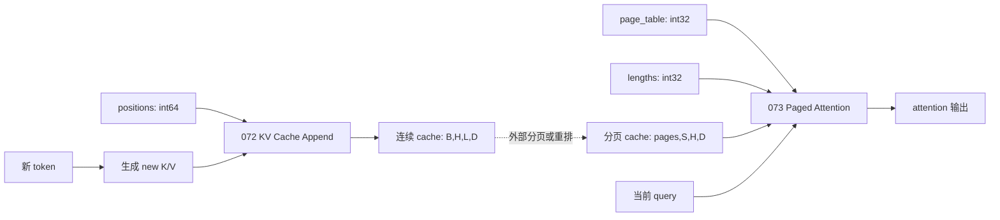

# 069–081：Transformer 推理算子

本章从零解释 attention、位置编码、KV cache、归一化、门控激活和解码辅助操作。Python 文件包含 Triton 实现；CUDA 文件是独立的 FP32 教学对照。它们不是生产级 FlashAttention、PagedAttention 或采样库。

## 基础概念

Transformer 把文本切成 token（词元），并把每个 token 表示为向量。模型从当前表示生成三类向量：query（查询）表示当前 token 想寻找的信息，key（键）表示一个 token 可被匹配的特征，value（值）表示匹配后要汇入输出的内容。Attention 先用 query 与 key 计算 score（相关性分数），再用 softmax 把一组 score 变成总和为 1 的权重，最后对 value 加权求和。每层可以使用多个 attention head，让不同 head 学习不同关系。常见布局 `[B,H,L,D]` 中，B 是 batch（同时处理的样本数），H 是 head 数，L 是序列长度，D 是每个 head 的向量维度。

推理通常分为 prefill 和 decode。Prefill 一次处理已有 prompt（输入文本）；decode 每轮生成一个新 token。每个 token 会产生 key 和 value。**KV cache** 保存它们，使 decode 不必重复计算旧 token。**RoPE** 用向量旋转编码位置。Logit 是模型为每个候选 token 生成、尚未归一化的分数；079–081 直接处理 logit 或其选择结果。

## 文件和 metadata dtype

| 编号 | 算子 | Triton | CUDA |
| --- | --- | --- | --- |
| 069 | Causal Attention | [Python](python/069_causal_attention.py) | [CUDA](cuda/069_causal_attention.cu) |
| 070 | RoPE | [Python](python/070_rope.py) | [CUDA](cuda/070_rope.cu) |
| 071 | ALiBi Bias | [Python](python/071_alibi_bias.py) | [CUDA](cuda/071_alibi_bias.cu) |
| 072 | KV Cache Append | [Python](python/072_kv_cache_append.py) | [CUDA](cuda/072_kv_cache_append.cu) |
| 073 | Paged Attention | [Python](python/073_paged_attention.py) | [CUDA](cuda/073_paged_attention.cu) |
| 074 | Residual LayerNorm | [Python](python/074_residual_layer_norm.py) | [CUDA](cuda/074_residual_layer_norm.cu) |
| 075 | Residual RMSNorm | [Python](python/075_residual_rms_norm.py) | [CUDA](cuda/075_residual_rms_norm.cu) |
| 076 | SwiGLU | [Python](python/076_swiglu.py) | [CUDA](cuda/076_swiglu.cu) |
| 077 | GEGLU | [Python](python/077_geglu.py) | [CUDA](cuda/077_geglu.cu) |
| 078 | MoE Expert Count | [Python](python/078_moe_expert_count.py) | [CUDA](cuda/078_moe_expert_count.cu) |
| 079 | Temperature Scaling | [Python](python/079_temperature_scale.py) | [CUDA](cuda/079_temperature_scale.cu) |
| 080 | Greedy Decode | [Python](python/080_greedy_decode.py) | [CUDA](cuda/080_greedy_decode.cu) |
| 081 | Repetition Penalty | [Python](python/081_repetition_penalty.py) | [CUDA](cuda/081_repetition_penalty.cu) |

Triton 浮点入口接受连续、同设备的 FP16、BF16 或 FP32 tensor。CUDA 对照使用 FP32。Python 中 072 positions 必须是 int64；073 page_table 和 lengths 必须是 int32；078 与 081 的 ID 可为 int32 或 int64。CUDA 078 和 081 只接受 int 指针，不能直接读取 int64 数据。

## KV cache 数据流

072 写入连续逻辑 cache；073 读取分页 cache。它们的布局不同，仓库没有自动转换步骤。下图表示概念关系，不是零拷贝调用管线。



## 逐算子学习指南

### 069 Causal Attention

#### 概念与用途

Causal attention 是自回归模型的核心。每个 query 只能读取当前及更早位置，不能看到未来 token。当前实现把 query 行号和 key 行号都视为从 0 开始，因此只正确表示“Q 和 K/V 从同一序列起点对齐”的前缀计算。

#### 输入输出

Q 是 `[B,H,Lq,D]`，K/V 是 `[B,H,Lk,D]`，输出 shape 与 Q 相同、dtype 为 FP32。score 除以 $\sqrt D$，key 行号大于 query 行号的位置置为负无穷，再执行稳定 softmax。实现没有 query position offset：常见增量 decode 的 `Lq=1,Lk>1` 会让唯一 query 只看到 key 0，而不是全部历史，因此不能用于正常的单 token decode。

#### 算法

1. 选择一个 batch、head 和 query row。
2. 计算 query 与所有 key 的点积。
3. mask 掉 key index 大于 query index 的 score。
4. 减最大值，计算指数和分母。
5. 用 probability 对 value 加权求和。

#### Triton 实现

Triton program instance ID 对应一个 query row。BLOCK_K 与 BLOCK_D 是长度和维度的下一次幂。Q 是一维 Triton block tensor；K/V 形成 BLOCK_K×BLOCK_D Triton block tensor。matrix mask 同时保护 key 和 dim 尾部。score 沿 D 归约，value 沿 K 归约。

Python wrapper 把 Lk 和 D 限制到 256，并要求 Lq<=Lk。空 batch、head 或 query 返回空 FP32 输出。`Lq<=Lk` 只是 shape 检查，不补偿 query 的绝对位置。

```python
q = tl.load(
    q_ptr + (batch_head * LQ + query_index) * D + dim_offsets,
    mask=dim_offsets < D, other=0.0,
)
k = tl.load(
    k_ptr + (batch_head * LK + key_offsets[:, None]) * D + dim_offsets[None, :],
    mask=matrix_mask, other=0.0,
)
scores = tl.sum(k * q[None, :], axis=1) * SCALE
scores = tl.where(causal_mask, scores, -float("inf"))
probabilities /= tl.sum(probabilities, axis=0)
result = tl.sum(probabilities[:, None] * v, axis=0)
```

Q 广播到所有 key row；第一次归约沿 D 生成 score，第二次归约沿 K 生成输出向量。

#### CUDA 实现

一个 CUDA thread block（CTA）负责一行。每个有效 CUDA thread 串行遍历 D 计算一个 key score。block_max 和 block_sum 完成 softmax，动态 shared memory 保存 probability。随后每个 CUDA thread 负责若干输出维度，并串行遍历 token 得到输出。

CUDA 允许 Lk/D 到 1024，却不拒绝 Lq>Lk。CUDA grid 的 batch×heads×Lq 和设备地址也未完整进行 64 位验证。

```cuda
const float maximum = block_max(score);
const float exponential = lane < key_length && lane <= query_index ? expf(score - maximum) : 0.0f;
const float denominator = block_sum(exponential);
if (lane < key_length) probabilities[lane] = exponential;
__syncthreads();
```

CUDA thread block（CTA）reduction 先稳定化 softmax，再把 probability 发布到 shared memory；barrier 保证 value 阶段看到完整数组。

#### GPU 硬件

一个 CUDA thread block（CTA）同时承担 score 和 value 阶段，但没有 tile 复用或 Tensor Core。长序列受单个 CUDA thread block（CTA）、shared memory 和重复全局读取限制。

#### 教程

用 Lq=Lk=17、D=32 对照 scaled_dot_product_attention(is_causal=True)。再显式测试 `Lq=1,Lk=17`，观察当前结果只读取 key 0，从而理解缺失 position offset 的限制。

#### 验证与限制

空 batch 和 Lq>Lk 用于检查 Python 拒绝路径。不要将结果当作 FlashAttention 性能。

### 070 RoPE

#### 概念与用途

RoPE 让 Q/K 的相对角度携带位置信息。

#### 输入输出

本实现输入/输出 [tokens,heads,D]，cos/sin [tokens,D/2]，并要求 D 为偶数。

#### 算法

把元素按 pair 编号，解码 token、head、frequency，读取 even/odd 与 cos/sin，再写两个旋转结果。

#### Triton 实现

每个 Triton program instance 处理 256 对，并使用 mask 保护尾部。

```python
base = (token * HEADS + head) * D + 2 * frequency
tl.store(out_ptr + base, even * cosine - odd * sine, mask=valid)
tl.store(out_ptr + base + 1, even * sine + odd * cosine, mask=valid)
```

base 指向一对相邻维度。

#### CUDA 实现

每个 CUDA thread 处理一对偶奇维。

```cuda
const float c = cosine[token * half + frequency];
out[base] = even * c - odd * s;
out[base + 1] = even * s + odd * c;
```

CUDA thread 直接写旋转后的两个分量。

#### GPU 硬件

访问连续，算术强度低；cos/sin 跨 head 重用。

#### 教程

用手写偶奇公式和 D=2 验证。

#### 验证与限制

它只支持 interleaved RoPE，不支持 split-half、position offset 或部分 rotary dimension。

### 071 ALiBi Bias

#### 概念与用途

ALiBi 是 Attention with Linear Biases（带线性偏置的注意力）。它不旋转向量，而是给每个 attention head 一条固定斜率，用 query 与 key 的距离改变 score。

#### 输入输出

本实现让 `scores[B,H,Q,K]` 加上 `slopes[h] * (key - query)`，输出 shape 和 dtype 不变。

#### 算法

解码扁平位置的 key/query/head，读取 slope，执行一次乘加。

#### Triton 实现

每个 Triton program instance 处理 256 个连续 score，并 mask 尾块。

```python
key = offset % KEYS
query = (offset // KEYS) % QUERIES
biased = score + slope * (key - query).to(tl.float32)
```

扁平索引恢复距离。

#### CUDA 实现

每个 CUDA thread 处理一个 score。

```cuda
out[offset] = scores[offset] + slopes[head] * static_cast<float>(key - query);
```

CUDA 为一元素执行同一乘加。

#### GPU 硬件

这是带宽受限逐元素 kernel，融合进 attention 可省一次 score 读写。

#### 教程

用小 Q×K 距离矩阵验证。

#### 验证与限制

本算子不执行 causal mask 或 softmax。

### 072 KV Cache Append

#### 概念与用途

Decode 每轮只产生少量新 K/V。append 把它们 scatter 到请求指定的逻辑 cache slot。

#### 输入输出

new K/V 是 [B,H,T,D]，positions 是 int64 [B,T]，cache 是 [B,H,max_sequence,D]。函数原地修改并返回两个 cache。

#### 算法

验证 shape、dtype、位置范围与每个 batch 的唯一性；把输入 offset 解码为 b/h/t/d；读取 position[b,t]；计算目标 [b,h,position,d]；分别写 K/V。

#### Triton 实现

每个 Triton program instance 处理 256 个标量。valid 先保护尾块，再加入 position 范围。new K/V 共用 destination。Python 的 CPU copy 与 sort 会同步并增加延迟。

```python
position = tl.load(positions_ptr + batch * TOKENS + token, mask=valid, other=-1)
valid &= (position >= 0) & (position < MAX_SEQUENCE)
destination = ((batch * HEADS + head) * MAX_SEQUENCE + position) * D + dim
tl.store(cache_k_ptr + destination, tl.load(new_k_ptr + offset, mask=valid), mask=valid)
```

position 是 scatter 的唯一间接索引。范围 mask 防止单次 out-of-bounds（OOB，越界）访问，但不能解决重复 destination 的数据竞争。

#### CUDA 实现

每个 CUDA thread 复制一个标量。destination 使用 long long，但 launcher 不检查重复 position。越界位置被静默跳过，不报告具体错误。

```cuda
const long long position = positions[batch * tokens + token];
if (position < 0 || position >= max_sequence) return;
const long long destination = ((static_cast<long long>(batch) * heads + head) * max_sequence + position) * dim + d;
cache_key[destination] = new_key[offset];
```

destination 提升为 64 位，但唯一性没有在 launcher 验证。

#### GPU 硬件

源读取连续，目标写入由 positions 决定。散乱 slot 降低写合并；重复目标会产生数据 race。

#### 教程

用两个 token 写非相邻 slot，并确认其他 cache 不变。

#### 验证与限制

Python 应测试重复/越界拒绝。metadata 检查存在 time-of-check to time-of-use（TOCTOU，检查后使用前数据又被修改）的窗口；调用期间必须保持 positions 不变。

### 073 Paged Attention

#### 概念与用途

Paged attention 通过页表访问非连续物理 KV page，使不同长度请求共享内存池并减少连续大块分配。

#### 输入输出

Q 为 [B,H,D]，cache 为 [P,S,H,D]，page_table 为 int32 [B,max_pages]，lengths 为 int32 [B]，输出 [B,H,D] FP32。逻辑 token 先映射 physical page 和 page offset，再参与标准 attention。

#### 算法

1. 读取请求 length。
2. 为每个逻辑 token 查 page_table。
3. 读取 K 并计算 score。
4. 对有效 token 做稳定 softmax。
5. 用相同页映射读取 V 并加权。
6. length=0 时输出 0。

#### Triton 实现

一个 Triton program instance 对应 batch/head。BLOCK_T 覆盖 max_sequence，BLOCK_D 覆盖 D。physical_page 由页表 gather；cache_base 组合 page、offset、head、dim。cache mask 不验证 physical_page，安全依赖 wrapper。

```python
physical_page = tl.load(table_ptr + batch * MAX_PAGES + token_offsets // PAGE_SIZE, mask=valid_token)
cache_base = ((physical_page * PAGE_SIZE + token_offsets % PAGE_SIZE) * HEADS + head) * D
k = tl.load(key_cache_ptr + cache_base[:, None] + dim_offsets[None, :], mask=cache_mask)
score = tl.sum(k * q[None, :], axis=1) * SCALE
```

逻辑 token 先 gather physical page，再形成 K/V 地址。cache_mask 不验证 physical page。

#### CUDA 实现

一个 CUDA thread block（CTA）对应 batch/head。每个 CUDA thread 计算一个 token score，probability 放入动态 shared memory；每个输出维度再遍历 value。launcher 没有 physical page count，无法验证 page ID。

```cuda
const int page = page_table[batch * max_pages + lane / page_size];
const long long base = ((static_cast<long long>(page) * page_size + lane % page_size) * heads + head) * dim;
score += q[batch_head * dim + d] * key_cache[base + d];
```

页号直接进入地址。CUDA launcher 缺少 physical page count，无法在这里证明 base 合法。

#### GPU 硬件

页表产生间接、可能不连续的全局读取。该实现要求一个 CUDA thread block（CTA）容纳与序列和维度相关的工作，并把 CUDA thread 数限制为至多 1024；它不支持跨 CUDA thread block（CTA）的 sequence partition 与在线归并。

#### 教程

让两个请求映射不同物理 page，手动拼接 logical K/V 对照，并测试 length=0。

#### 验证与限制

CUDA 非法 page ID 可造成 OOB 访问；Python metadata 检查存在 TOCTOU 窗口。

### 074 Residual LayerNorm

#### 概念与用途

融合 residual addition 与 LayerNorm，减少中间 z 的显存写回。

#### 输入输出

x/residual 是 `[rows,cols]`，gamma/beta 是 `[cols]`，输出同 shape/dtype：

$$
y=\frac{z-\mu}{\sqrt{\sigma^2+\epsilon}}\gamma+\beta,\qquad z=x+residual.
$$

#### 算法

求 z=x+residual、行均值、总体方差、标准化结果，最后应用 gamma 和 beta。

#### Triton 实现

一个 Triton program instance 用 BLOCK 个逻辑元素覆盖一行。被 mask 的逻辑元素补 0，均值和方差均在 FP32 归约。

```python
mean = tl.sum(z, axis=0) / cols
variance = tl.sum(centered * centered, axis=0) / cols
tl.store(
    out_ptr + row * cols + col,
    centered * tl.rsqrt(variance + eps) * gamma + beta, mask=mask,
)
```

两次行归约完成 LayerNorm。

#### CUDA 实现

一个 CUDA thread block（CTA）负责一行。第一次 block_sum 求均值，第二次求平方差；shared mean 和 reduction helper 需要 CUDA thread block（CTA）同步。

```cuda
const float mean_value = block_sum(local_sum) / cols;
const float inverse = rsqrtf(block_sum(local_square) / cols + eps);
```

CUDA thread block（CTA）复用 block reduction helper。

#### GPU 硬件

连续行读取易于合并。融合省去 z 写回，但两次归约仍产生同步开销。

#### 教程

用常量行验证归一化部分为 0、输出为 beta。

#### 验证与限制

Triton cols 上限 65536，eps 必须有限且为正。

### 075 Residual RMSNorm

#### 概念与用途

RMSNorm 用均方根缩放 residual sum，不减均值，常见于现代 LLM。

#### 输入输出

x/residual [rows,cols]、gamma [cols]，输出同 shape/dtype；没有 beta。

#### 算法

求 z、z² 的行均值、逆均方根，再逐元素乘 z 和 gamma。

#### Triton 实现

一个 Triton program instance 覆盖一行，只需一次平方和归约。

```python
square_mean = tl.sum(tl.where(mask, z * z, 0.0), axis=0) / cols
tl.store(
    out_ptr + row * cols + col,
    z * tl.rsqrt(square_mean + eps) * gamma, mask=mask,
)
```

RMSNorm 只需平方和归约。

#### CUDA 实现

一个 CUDA thread block（CTA）用 block_sum 得到 square mean，再由 CUDA thread 跨列写结果。

```cuda
const float inverse = rsqrtf(block_sum(local_square) / cols + eps);
out[row * cols + col] = z * inverse * gamma[col];
```

每个 CUDA thread 写其跨步列。

#### GPU 硬件

比 074 少均值归约，仍受行读取和 CUDA thread block（CTA）reduction 限制。

#### 教程

对照 FP32 手写 reference，加入常量行和低精度。

#### 验证与限制

Triton cols 上限 65536。

### 076 SwiGLU

#### 概念与用途

SwiGLU 是门控 MLP 激活，用一个分支控制另一个分支通过多少信息。

#### 输入输出

gate/value shape 与 dtype 相同，输出同 shape/dtype，公式为 SiLU(gate)×value。

#### 算法

逐元素计算 sigmoid、gate×sigmoid 和 value 乘积。

#### Triton 实现

每个 Triton program instance 处理 256 个元素，masked load 保护尾块，中间提升 FP32。

```python
gate = tl.load(gate_ptr + offset, mask=mask).to(tl.float32)
tl.store(out_ptr + offset, gate / (1.0 + tl.exp(-gate)) * value, mask=mask)
```

中间计算提升 FP32。

#### CUDA 实现

每个 CUDA thread 处理一个元素，并用绝对值形式的稳定 sigmoid 分支。

```cuda
const float exponential = expf(-fabsf(value));
return value >= 0.0f ? 1.0f / (1.0f + exponential) : exponential / (1.0f + exponential);
```

分支避免有限大负数直接计算 exp(-value)。

#### GPU 硬件

连续访问且算术强度低，适合与前后线性层融合。

#### 教程

验证大正负有限值，观察稳定 sigmoid 分支在输入绝对值很大时仍保持有限结果。

#### 验证与限制

还应验证元素总数不是 256 整倍数的尾块，以及三种支持的 dtype。

### 077 GEGLU

#### 概念与用途

GEGLU 用 GELU 作为门控函数，是另一种 gated MLP 结构。

#### 输入输出

gate/value shape 与 dtype 相同，输出为近似 GELU(gate)×value。

#### 算法

计算 cubic inner、tanh 近似 GELU，再乘 value。

#### Triton 实现

每个 Triton program instance 处理 256 个元素，中间值为 FP32，尾部使用 mask。

```python
inner = 0.7978845608028654 * (gate + 0.044715 * gate * gate * gate)
gelu = 0.5 * gate * (1.0 + (2.0 / (1.0 + tl.exp(-2.0 * inner)) - 1.0))
```

sigmoid 形式等价 tanh 近似。

#### CUDA 实现

每个 CUDA thread 调用 tanhf 完成一个元素，没有共享状态。

```cuda
const float inner = 0.7978845608028654f * (x + 0.044715f * x * x * x);
const float gelu = 0.5f * x * (1.0f + tanhf(inner));
```

CUDA 直接调用 tanhf。

#### GPU 硬件

特殊函数吞吐可能成为瓶颈，访问模式本身连续。

#### 教程

对照 gelu(approximate=tanh)，确认近似 GELU 公式一致。

#### 验证与限制

还应测试尾块和 FP16/BF16。

### 078 MoE Expert Count

#### 概念与用途

MoE 是 Mixture of Experts（混合专家）。路由器把每个 token 分配给一个或多个 expert（通常是独立前馈子网络）。本算子统计每个 expert 收到的 token 数，供后续分组、分配缓冲区和调度工作量使用；它不执行路由或 expert 网络本身。

#### 输入输出

输入是任意 shape 的 expert IDs，输出 int32 [num_experts]。

#### 算法

初始化 counts；读取每个 ID；忽略越界 ID；对有效 expert 原子加一。

#### Triton 实现

每个 Triton program instance 处理 256 个 ID，torch.zeros 在 kernel 前初始化输出。

```python
valid = mask & (expert >= 0) & (expert < experts)
tl.atomic_add(counts_ptr + expert, 1, mask=valid)
```

mask 同时保护尾块和 ID 范围。

#### CUDA 实现

cudaMemsetAsync 在传入 stream 清零，随后每个 CUDA thread 执行一次可选 atomicAdd。

```cuda
CUDA_CHECK(cudaMemsetAsync(counts, 0, experts * sizeof(int), stream));
if (expert >= 0 && expert < experts) atomicAdd(counts + expert, 1);
```

清零和 atomic kernel 位于同一 stream。

#### GPU 硬件

热点 expert 让许多 atomic 竞争同一地址，吞吐反映路由不均衡程度。

#### 教程

分别验证均匀和集中路由，并精确比较整数。

#### 验证与限制

输出可能 int32 溢出；CUDA 只接受 int32 ID。

### 079 Temperature Scaling

#### 概念与用途

Temperature 控制后续 softmax 分布尖锐程度，但本算子本身不采样。

#### 输入输出

任意 shape 浮点 logits 逐元素除正数 T，输出同 shape/dtype。

#### 算法

验证 T 有限且大于 0；分配输出；逐元素执行除法。

#### Triton 实现

每个 Triton program instance 处理 256 个连续元素，以 mask 保护尾块。

```python
tl.store(out_ptr + offset, tl.load(logits_ptr + offset, mask=mask) / temperature, mask=mask)
```

一个向量表达完整逐元素运算。

#### CUDA 实现

每个 CUDA thread 读取、除法并写一个元素。

```cuda
if (offset < count) out[offset] = logits[offset] / temperature;
```

CUDA 使用标准尾部条件。

#### GPU 硬件

连续读写、低算术强度，通常受显存带宽限制。

#### 教程

验证 T=1、T<1、T>1，观察温度不变、分布变尖和分布变平三种情况。

#### 验证与限制

确认 0、NaN、Inf 被拒绝。

### 080 Greedy Decode

#### 概念与用途

Greedy decode 选择每行 logit 最高的 token，不保留其他候选。对全部有限 logit，softmax 保持大小顺序，所以这也等价于选择 softmax 概率最高的 token；本算子不需要真的计算 softmax。

#### 输入输出

输入 logits [batch,vocab]，输出 int64 [batch]，即每行 argmax。

#### 算法

逐行寻找最大 logit 的索引。若多个有限 logit 相同，选择最左侧、也就是索引最小的 token。

#### Triton 实现

一个 Triton program instance 加载整行到下一次幂 BLOCK，并调用 tl.argmax。

```python
logits = tl.load(logits_ptr + batch * vocab + token, mask=token < vocab, other=-float("inf"))
tl.store(out_ptr + batch, tl.argmax(logits, axis=0, tie_break_left=True))
```

负无穷填充不会胜过有效有限 logit。

#### CUDA 实现

一个 CUDA thread block（CTA）负责一行。每个 CUDA thread 扫描部分 vocab，保存局部 value/index；随后把 value 和 index 放入动态 shared memory，再二分归约。

```cuda
if (other > best_values[threadIdx.x] ||
    (other == best_values[threadIdx.x] && other_index < best_indices[threadIdx.x])) {
  best_values[threadIdx.x] = other;
  best_indices[threadIdx.x] = other_index;
}
```

value/index 成对归约实现左侧 tie-break。

#### GPU 硬件

行归约需要同步，vocab 越宽，每个 CUDA thread block（CTA）读取越多数据。

#### 教程

验证唯一最大值和有限 tie。

#### 验证与限制

当前测试未覆盖 NaN；`tl.argmax` 的比较归约不提供可依赖的通用 NaN 选择契约，因此含 NaN 输入的行为属于未验证边界，不能据此断言与 `torch.argmax` 的关系。Triton vocab 上限为 65536。

### 081 Repetition Penalty

#### 概念与用途

当 `penalty > 1` 时，这个算子降低已出现 token 的相对吸引力，可减少生成文本反复重复。wrapper 接受任意有限正数；当 $0<p<1$ 时，同一公式会提高已出现 token 的相对吸引力，实际成为 repetition reward。

#### 输入输出

logits `[B,V]` 被原地修改，token_ids `[B,history]` 可为 int32/int64：

$$
z_t'=\begin{cases}
z_t/p, & z_t>0,\\
z_t p, & z_t\le 0.
\end{cases}
$$

#### 算法

验证 ID 范围与唯一性；读取稀疏 logit；按正负选择除法或乘法；写回原位置。

#### Triton 实现

一个 Triton program instance 负责一个 batch row，Triton block tensor 的逻辑元素覆盖 history。

```python
token = tl.load(token_ids_ptr + batch * history + offset, mask=mask)
value = tl.load(logits_ptr + batch * vocab + token, mask=valid)
adjusted = tl.where(value > 0.0, value / penalty, value * penalty)
tl.store(logits_ptr + batch * vocab + token, adjusted, mask=valid)
```

每个逻辑元素对一个历史 ID 做稀疏 read-modify-write（RMW，读取、修改再写回）。

#### CUDA 实现

二维 CUDA grid 以 y 表示 batch、x 表示 history block，每个 CUDA thread 做一次稀疏 read-modify-write。

```cuda
const int token = token_ids[batch * history + offset];
const float value = logits[batch * vocab + token];
logits[batch * vocab + token] = value > 0.0f ? value / penalty : value * penalty;
```

没有 atomic；唯一性是避免 race 的必要前提。

#### GPU 硬件

目标地址由 ID 决定，写入通常不合并；重复目标会产生 race。

#### 教程

验证正、负、零 logit，分别观察除以 penalty、乘以 penalty 和零保持不变。

#### 验证与限制

测试非法和重复 ID。注意 Python 的 metadata 检查存在 TOCTOU 窗口；CUDA 无唯一性检查且只接受 int32。

## 运行与验证

在支持的 GPU 主机运行：

```shell
python3 -m pytest -q tests/test_07_transformer_inference.py
python3 benchmarks/run.py --op 069 --size small --check
```

--check 是可选参数。默认 benchmark 只计时，不先验证正确性。benchmark 只加载 Python/Triton，不编译或运行 CUDA。整型输出也使用统一的 rtol=atol=0.02 比较，较大的错误 ID 可能被误判为接近；索引结果应精确比较。

现有测试覆盖普通 FP32 输入、069 self-attention、070–071 公式、有效 KV metadata、073 零长度、074–077 常见 shape、080 有限值 tie 和部分非法参数。

它不覆盖 FP16/BF16、非默认 stream metadata、072/081 重复 ID race、073 非法 CUDA page ID、080 NaN、大尺寸溢出、CUDA 编译或 CUDA 运行。测试通过不能证明 CUDA 对照安全。

069 和 073 把整行 attention 放进一个 Triton program instance 或 CUDA thread block（CTA），只适合短序列教学。只有完成正确性检查、warmup、同步和重复计时后，才能报告性能。不要把结果直接解释为对生产推理 runtime 的比较。
