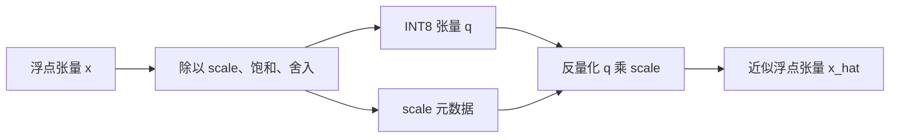

# 082–088：量化

张量（tensor）是按多个维度组织的同类型数字数组。浮点数用符号位、指数和有效数字近似表示实数；FP16、BF16 和 FP32 分别使用 16、16 和 32 位。INT8 是 8 位有符号整数，完整范围是 $[-128,127]$。量化（quantization）把浮点张量映射为有限的整数；反量化（dequantization）再把整数映射为近似浮点值。

本章用 082–088 七个算子讲清这条数据路径。图形处理器（GPU）通过大量并行计算单元执行 GPU kernel，也就是在 GPU 上运行的函数。Triton 是用 Python 编写 GPU kernel 的领域专用语言；CUDA 是 NVIDIA 的 GPU 编程平台和编程模型。本章的 Python 文件提供 Triton 实现，`.cu` 文件提供独立的 FP32/INT8 CUDA 教学实现。CUDA 文件不是 PyTorch 扩展。

- Triton：[`python/`](./python/)
- CUDA：[`cuda/`](./cuda/)
- 测试：[`test_08_quantization.py`](../../tests/test_08_quantization.py)
- 基准测试：[`benchmarks/run.py`](../../benchmarks/run.py)

## 源码地图

| 编号 | Triton | CUDA |
| ---: | --- | --- |
| 082 | [`python/082_per_tensor_quantize.py`](python/082_per_tensor_quantize.py) | [`cuda/082_per_tensor_quantize.cu`](cuda/082_per_tensor_quantize.cu) |
| 083 | [`python/083_per_tensor_dequantize.py`](python/083_per_tensor_dequantize.py) | [`cuda/083_per_tensor_dequantize.cu`](cuda/083_per_tensor_dequantize.cu) |
| 084 | [`python/084_per_row_quantize.py`](python/084_per_row_quantize.py) | [`cuda/084_per_row_quantize.cu`](cuda/084_per_row_quantize.cu) |
| 085 | [`python/085_per_channel_quantize.py`](python/085_per_channel_quantize.py) | [`cuda/085_per_channel_quantize.cu`](cuda/085_per_channel_quantize.cu) |
| 086 | [`python/086_int8_matmul.py`](python/086_int8_matmul.py) | [`cuda/086_int8_matmul.cu`](cuda/086_int8_matmul.cu) |
| 087 | [`python/087_fake_quantize.py`](python/087_fake_quantize.py) | [`cuda/087_fake_quantize.cu`](cuda/087_fake_quantize.cu) |
| 088 | [`python/088_blockwise_quantize.py`](python/088_blockwise_quantize.py) | [`cuda/088_blockwise_quantize.cu`](cuda/088_blockwise_quantize.cu) |

## 基础概念

### 量化、反量化和 `scale`

`scale` 是严格为正的浮点数，表示 INT8 增加 1 时对应多少浮点值。小 `scale` 能更细致地区分零附近的值，但覆盖的浮点范围更小。大 `scale` 覆盖更大范围，但相邻 INT8 编码之间的误差更大。离群值是绝对值远大于多数元素的值；一个离群值可能迫使许多正常元素使用过大的 `scale`。

本章使用对称量化。对称表示浮点零映射到整数零，因此 zero point（零点）固定为 0。量化器有意使用对称编码范围 $[-127,127]$，不生成 INT8 能表示的 $-128$：

$$
q=\operatorname{clip}_{[-127,127]}\left(\operatorname{round}_{\mathrm{away}}(x/s)\right),
\qquad \hat{x}=sq.
$$

其中，$x$ 是原浮点值，$s$ 是 `scale`，$q$ 是 INT8 结果，$\hat{x}$ 是反量化后的近似值。`clip` 把超出范围的值截到边界。这个过程称为饱和（saturation），而且会永久丢失范围外的信息。`round_away` 对半整数执行远离零舍入，例如 $2.5\to3$、$-2.5\to-3$。Triton helper（辅助函数）用 `floor` 和 `ceil` 实现该规则；CUDA helper 在裁剪后调用 `roundf`。两者对有限输入采用相同规则。

### 元数据和标定

元数据（metadata）是解释主数据所需的辅助数据。INT8 张量只保存整数编码；消费方还需要对应的 `scale` 才能恢复数值范围。本章的元数据只有 `scale`，因为 zero point 固定为 0。

标定（calibration）是根据数据范围选择 `scale` 的过程。离线标定先用有代表性的数据统计范围，再把固定 `scale` 交给部署程序。082、083、086 和 087 由调用方提供 `scale`。084、085 和 088 则在每次调用时用绝对值最大值动态计算 `scale`。

文中“多个元素共享同一个 `scale`”只表示这些元素使用数值相同的标量，不表示这个标量存放在 CUDA `shared memory`。`shared memory` 是同一 CUDA thread block（CTA）内部共享的片上暂存空间；CUDA thread block（CTA）是一组协同执行的 CUDA thread。调用方传入的 `scale` 张量和 kernel 写出的 `scales` 张量都位于设备全局内存，也就是 GPU 上保存输入和输出、可被各 CUDA thread block（CTA）访问的内存。084、085 和 088 的 CUDA 实现仅在 `block_max` 归约期间使用 `shared memory` 保存临时部分结果。



### 数据布局和量化粒度

形状（shape）描述张量每个维度的长度，数据类型（dtype）描述每个元素的表示方式。连续（contiguous）张量把逻辑相邻元素连续存放。本章的二维张量使用行主序（row-major）布局：同一行的列连续，`x[row,col]` 的线性偏移是 `row * cols + col`。展平（flatten）只按这个连续存储顺序把多维张量看成一维序列，不移动数据。

通道（channel）是由模型语义指定的一组数。本章的 085 不推断模型语义，只固定把最后一维当作 channel。对于权重矩阵 `W[K,N]` 和计算 `Y[M,N] = X[M,K] @ W[K,N]`，`W` 的列对应输出维度 $N$，因此这时每列才是一个输出通道。对其他含义的二维张量，最后一维仍是本实现的 channel，但不一定代表输出通道。

tile 是一次协同处理的矩形子矩阵。086 把输出矩阵切成 32×32 tile；这里的 tile 不是 CUDA thread block（CTA），也不是 088 的一维量化块。

| 量化粒度 | 算子 | `scale` 数量 | 主要权衡 |
| --- | --- | ---: | --- |
| 整个张量 | 082、083、087；086 的每个输入 | 1 | 元数据最少，但一个离群值影响所有元素 |
| 每行 | 084 | 行数 | 适合各行动态范围不同的矩阵 |
| 最后一维的每列 | 085 | 列数 | 适合 `[K,N]` 权重的输出通道，但行主序访问跨步 |
| 每个连续量化块 | 088 | $\lceil\text{元素数}/\text{block\_size}\rceil$ | 局部精度更高，但元数据更多 |

### CUDA 和 Triton 的最小执行模型

CUDA thread 是 CUDA 中最小的程序员可见执行实体。多个 CUDA thread 组成 CUDA thread block（CTA），多个 CUDA thread block（CTA）组成 CUDA grid，也就是一次 kernel 启动的全部 CUDA thread block（CTA）。GPU 通常把同一 CUDA thread block（CTA）中的 32 个 CUDA thread 编成一个 warp 并锁步调度。寄存器通常保存单个 CUDA thread 的局部值；`shared memory` 是同一 CUDA thread block（CTA）可见的片上暂存空间；设备全局内存保存输入和输出，容量大但延迟更高。相邻 CUDA thread 访问相邻地址时，GPU 可以把请求合并为较少的内存事务，这称为合并访存。

```text
CUDA grid
└── CUDA thread block（CTA）
    └── warp
        └── CUDA thread
```

Triton launch grid 是一次 Triton kernel 启动的全部 Triton program instance。Triton program instance 由 `tl.program_id` 标识。`tl.arange` 创建 Triton block tensor，也就是一组逻辑元素。Triton 编译器再把这些逻辑元素映射到 CUDA thread 和 warp；不能把一个 Triton 逻辑元素直接等同于一个 CUDA thread。`mask` 是与 Triton block tensor 同形状的布尔条件，用来阻止越界的加载和存储。默认 `num_ctas=1` 时，一个 Triton program instance 通常对应一个 CUDA thread block（CTA）；固定 NVIDIA 后端只在 SM90+ 上支持 `num_ctas>1` 的 CUDA thread block cluster，其他后端也必须显式报告支持 multi-CTA launch。

CPU（中央处理器）运行 Python wrapper（包装函数）和 CUDA launcher（启动函数），检查参数并请求 GPU 启动 kernel。GPU 负责并行计算。Tensor Core 是部分 GPU 上执行小矩阵乘加的专用计算单元。设备内存带宽表示 GPU 每秒能传输多少数据；数据搬运时间主导的 kernel 称为带宽受限 kernel。

寄存器是 GPU 上保存计算中间值的快速存储。一个 CUDA thread 或 Triton program instance 需要的寄存器增多时，同一计算单元能同时容纳的工作可能减少；这种资源需求称为寄存器压力。

归约（reduction）把一组输入合并成较少输出，例如取一行的最大绝对值。084、085 和 088 执行最大值归约。082、083 和 087 是按连续元素读写的流式 kernel。086 使用二维 tile 和点积。

## 运行教程

### 前置条件

运行本章需要以下环境：

- CPython 3.10–3.14。CPython 是 Python 语言的标准实现；
- 可导入的 PyTorch、Triton 和 pytest。PyTorch 提供张量和参考算子，pytest 运行自动测试；
- PyTorch 能识别的 CUDA 或 ROCm GPU，以及匹配的驱动和运行时。ROCm 是 AMD 的 GPU 软件平台，驱动和运行时负责让程序访问 GPU；
- 足以编译目标 kernel 的 GPU 架构。086 还依赖目标后端支持 Triton 的 INT8 `tl.dot` lowering，也就是能把高级点积操作转换为目标 GPU 指令。

项目没有锁定依赖版本，也没有把 `.cu` 文件接入构建系统。以下命令只运行 Python/Triton 路径，不编译或运行 CUDA 路径。

### 检查环境

先在终端进入仓库根目录，也就是同时包含 `README.md`、`categories/`、`tests/` 和 `benchmarks/` 的目录。然后运行：

```shell
python3 -c 'import pytest, torch, triton; print(torch.__version__, triton.__version__, torch.cuda.is_available())'
```

最后一项输出 `True` 表示 PyTorch 看到了可用 GPU。导入失败表示依赖未安装或版本不兼容；输出 `False` 表示当前环境不能运行 GPU 测试。

### 运行正确性测试和第一个 benchmark

```shell
python3 -m pytest -q tests/test_08_quantization.py
python3 benchmarks/run.py --op 082 --check
```

测试成功时，pytest 的摘要以 `passed` 结束。基准测试（benchmark）用于对比实现的运行时间；PyTorch reference 是用于核对结果的 PyTorch 基准实现。benchmark 的第一个成功信号是 `correctness=PASS`，随后会出现以 `op=082` 开头的计时行。runner 输出 Triton 时间、PyTorch reference 时间、speedup（reference 时间除以 Triton 时间），以及部分 case 的估算带宽。它不输出 TOPS（每秒万亿次操作）、TFLOP/s（每秒万亿次浮点操作）、Tensor Core 利用率、误差分布或 profiler（性能分析器）指标。

不要用 086 作为首次运行检查。当前测试和 benchmark 的 086 reference 调用 `a.int() @ b.int()`；PyTorch CUDA 不支持通用 INT32 `mm` 的环境会在 reference 阶段失败，即使 Triton kernel 本身可以编译。该失败不能证明 086 的 Triton 输出错误。086 还可能因目标 GPU 不支持 INT8 `tl.dot` lowering 而在 JIT（just-in-time，运行时即时编译）阶段失败。

## 082：Per-Tensor Quantize

### 概念与用途

Per-tensor quantization（逐张量量化）让整个张量使用一个数值相同的标量 `scale`。它的元数据最少，适合已经完成离线标定的简单部署路径。一个离群值也会迫使其他元素使用更粗的量化步长。

### 输入输出

`op082_per_tensor_quantize(x, scale)` 接受任意形状的连续 FP16、BF16 或 FP32 张量 `x`，以及只含一个元素的浮点 `scale` 张量。输出保持 `x` 的 shape，dtype 为 INT8。

Python wrapper 把设备上的 `scale` 复制到 CPU，检查它是否有限且严格为正。`.cpu().item()` 会同步 GPU。CUDA launcher 不做同等检查，因此 CUDA 调用方必须保证 `scale[0]` 有效。

### 算法

算法按连续存储顺序执行：

1. 把输入看成一维元素序列。
2. 每个元素除以同一个标量 `scale`。
3. 把结果饱和到 $[-127,127]$。
4. 执行半远离零舍入并转换为 INT8。

### Triton 实现

```python
offset = tl.program_id(0) * BLOCK + tl.arange(0, BLOCK)
mask = offset < count
value = tl.load(x_ptr + offset, mask=mask).to(tl.float32)
scale = tl.load(scale_ptr).to(tl.float32)
tl.store(q_ptr + offset, _op082_round_and_clamp_int8(value / scale), mask=mask)
```

`tl.program_id(0)` 选择一个 Triton program instance。`tl.arange` 创建 256 个连续逻辑偏移。`mask` 保护最后一个不完整范围。输入和 `scale` 都提升到 FP32 计算，helper 完成饱和、舍入和 INT8 转换，最后写回有效位置。

### CUDA 实现

```cuda
const int offset = blockIdx.x * blockDim.x + threadIdx.x;
if (offset < count)
  q[offset] = quantization_detail::op082_quantize_value(x[offset], scale[0]);
```

`blockIdx.x` 选择 CUDA thread block（CTA），`threadIdx.x` 选择其中的 CUDA thread。两者计算唯一的线性偏移。边界判断保护最后一个不完整的 CUDA thread block（CTA）。每个有效 CUDA thread 读取一个输入和全局内存中的 `scale[0]`，再写一个 INT8。

### GPU 硬件

相邻 CUDA thread 访问相邻输入和输出地址，因此访存可以合并。kernel 没有归约、`shared memory` 或 Tensor Core 操作。大张量通常受设备内存带宽限制；小张量更容易受 kernel launch 和 Python wrapper 同步开销影响。硬件缓存可能复用对 `scale[0]` 的读取，但源码没有把它放进 `shared memory`。

### 教程

完成[运行教程](#运行教程)中的环境检查后，在仓库根目录运行 082 的定向测试和带正确性检查的 benchmark：

```shell
python3 -m pytest -q tests/test_08_quantization.py -k 'op082'
python3 benchmarks/run.py --op 082 --check
```

pytest 摘要应以 `passed` 结束。benchmark 应先输出 `correctness=PASS`，再输出以 `op=082` 开头的计时行。

### 验证与限制

测试覆盖 1003 元素尾部、饱和和有限半整数舍入，但量化输入只使用 FP32。

非有限输入没有统一契约。对 NaN，Triton 默认 `minnum/maxnum`、CUDA 的 `fminf/fmaxf` 嵌套顺序和当前 PyTorch reference 可能分别得到 `127`、`-127` 和 `0`。不要把 NaN 传给本量化器；调用方应先拒绝或清理非有限输入。

## 083：Per-Tensor Dequantize

### 概念与用途

Per-tensor dequantization（逐张量反量化）把 INT8 编码重新映射到浮点计算域。它不能恢复量化时因舍入或饱和丢失的信息。部署系统常把反量化融合进后续算子，以免写出完整的 FP32 中间张量。

### 输入输出

`op083_per_tensor_dequantize(q, scale)` 接受连续 INT8 张量 `q` 和只含一个元素的浮点 `scale` 张量。输出固定为 FP32 并保持 `q` 的 shape。输入也可以包含其他程序产生的 `-128`。

Python wrapper 检查 `scale` 有限且严格为正；CUDA launcher 不做同等检查。

### 算法

算子按元素计算 $q_i s$：

1. 按连续偏移读取 INT8。
2. 把有符号 INT8 转换为 FP32。
3. 乘同一个标量 `scale` 并写出 FP32。

### Triton 实现

```python
quantized = tl.load(q_ptr + offset, mask=mask).to(tl.float32)
scale = tl.load(scale_ptr).to(tl.float32)
tl.store(out_ptr + offset, quantized * scale, mask=mask)
```

第一行读取并保留 INT8 的符号。第二行从设备全局内存读取单元素 `scale`。第三行只写 `mask` 标记的有效位置。

### CUDA 实现

```cuda
if (offset < count)
  out[offset] = static_cast<float>(q[offset]) * scale[0];
```

每个有效 CUDA thread 把一个有符号 INT8 转换为 FP32，再乘 `scale[0]`。

### GPU 硬件

这是流式 kernel。每个元素读取 1 byte 并写 4 bytes，数据几乎不复用。大张量通常受设备内存写带宽限制；小张量更受 kernel launch 开销影响。

### 教程

完成[运行教程](#运行教程)中的环境检查后，在仓库根目录运行 083 的定向测试和带正确性检查的 benchmark：

```shell
python3 -m pytest -q tests/test_08_quantization.py -k 'op082_083_087 or op083'
python3 benchmarks/run.py --op 083 --check
```

pytest 摘要应以 `passed` 结束。benchmark 应先输出 `correctness=PASS`，再输出以 `op=083` 开头的计时行。

### 验证与限制

测试覆盖普通结果和 `q=-128`。

## 084：Per-Row Quantize

### 概念与用途

Per-row quantization（逐行量化）为二维张量的每一行动态计算一个 `scale`。它适合不同行具有不同数值范围的 token、样本或输出单元。

### 输入输出

`op084_per_row_quantize(x)` 接受二维连续 FP16、BF16 或 FP32 张量 `x[rows,cols]`。输出包括同 shape 的 INT8 张量 `q` 和 FP32 张量 `scales[rows]`。`cols` 必须在 1 到 65536 之间；`rows=0` 合法。

### 算法

对 `x[rows,cols]` 的每一行执行：

$$
s_r=\max\left(\frac{\max_c|x_{r,c}|}{127},10^{-12}\right),
\qquad q_{r,c}=Q(x_{r,c};s_r).
$$

下限 $10^{-12}$ 让全零行仍具有正 `scale`。

算法分为四步：

1. 一个 Triton program instance 或 CUDA thread block（CTA）选择一行。
2. 读取该行并归约出最大绝对值。
3. 计算该行 `scale`。
4. 再次处理该行，用这个标量量化每个元素，并保存一个 `scales[row]`。

### Triton 实现

```python
row = tl.program_id(0)
col = tl.arange(0, BLOCK)
mask = col < cols
value = tl.load(x_ptr + row * cols + col, mask=mask, other=0.0).to(tl.float32)
absolute_maximum = tl.max(tl.abs(value), axis=0)
scale = tl.maximum(absolute_maximum / 127.0, 1.0e-12)
tl.store(q_ptr + row * cols + col, _op082_round_and_clamp_int8(value / scale), mask=mask)
tl.store(scales_ptr + row, scale)
```

`row` 选择行。`col` 是覆盖下一个二次幂宽度的 Triton block tensor；越过 `cols` 的逻辑元素由 `mask` 屏蔽，并用 0 参加归约。`tl.max` 把整行绝对值合并为一个值。标量 `scale` 随后用于所有有效列，并写入一个元数据位置。

### CUDA 实现

```cuda
const int row = blockIdx.x;
float local_maximum = 0.0f;
for (int col = threadIdx.x; col < cols; col += blockDim.x)
  local_maximum = fmaxf(local_maximum, fabsf(x[row * cols + col]));
const float scale =
    quantization_detail::op082_symmetric_scale(block_max(local_maximum));
for (int col = threadIdx.x; col < cols; col += blockDim.x)
  q[row * cols + col] =
      quantization_detail::op082_quantize_value(x[row * cols + col], scale);
if (threadIdx.x == 0) scales[row] = scale;
```

`blockIdx.x` 选择一行。第一个循环让 CUDA thread block（CTA）内的 CUDA thread 分摊列并计算局部最大值。`block_max` 把这些局部值归约并把结果返回给全部 CUDA thread。第二个循环重新读取输入并量化。只有 CUDA thread 0 把一个 `scale` 写入 `scales[row]`。

### GPU 硬件

同一轮循环中的相邻 CUDA thread 访问相邻列，因此行主序访存能够合并。`block_max` 先用 warp shuffle（同一 warp 的 CUDA thread 直接交换寄存器值）合并各 warp 内的值，再用 `shared memory` 数组 `partial[32]` 合并 warp 结果。同步屏障让 CUDA thread 等待同组其他 CUDA thread，保证所有写入在读取结果前完成。CUDA 版本两次从设备全局内存读取该行。Triton 源码只写一次 `tl.load`，编译器决定值保留和寄存器分配。较宽的行会增加归约成本和寄存器压力。

### 教程

完成[运行教程](#运行教程)中的环境检查后，在仓库根目录运行 084 的定向测试和带正确性检查的 benchmark：

```shell
python3 -m pytest -q tests/test_08_quantization.py -k 'op084'
python3 benchmarks/run.py --op 084 --check
```

pytest 摘要应以 `passed` 结束。benchmark 应先输出 `correctness=PASS`，再输出以 `op=084` 开头的计时行。

### 验证与限制

测试覆盖 `[7,193]` 和全零行。Inf 会产生 Inf `scale`，随后 `Inf/Inf` 成为 NaN；该结果不可用。二维线性地址使用 32 位整数表达式，超大张量的偏移可能溢出，wrapper 没有检查总元素乘积。

## 085：Per-Channel Quantize

### 概念与用途

Per-channel quantization（逐通道量化）为二维张量最后一维的每一列动态计算一个 `scale`。本实现始终把最后一维当作 channel，不支持选择其他 channel 维度。对于 `[K,N]` 权重，列 $N$ 是输出通道；对于其他矩阵，列不一定具有输出通道语义。

### 输入输出

`op085_per_channel_quantize(x)` 接受二维连续 FP16、BF16 或 FP32 张量 `x[rows,channels]`。输出包括同 shape 的 INT8 张量 `q` 和 FP32 张量 `scales[channels]`。`rows` 必须在 1 到 65536 之间；`[0,C]` 不受支持，`[R,0]` 返回空输出。

### 算法

本实现计算：

$$
s_c=\max\left(\frac{\max_r|x_{r,c}|}{127},10^{-12}\right).
$$

1. 一个 Triton program instance 或 CUDA thread block（CTA）选择一列。
2. 沿行方向归约出该列的最大绝对值。
3. 计算并保存一个列 `scale`。
4. 用这个标量量化该列的所有元素。

### Triton 实现

```python
col = tl.program_id(0)
row = tl.arange(0, BLOCK)
mask = row < rows
value = tl.load(x_ptr + row * cols + col, mask=mask, other=0.0).to(tl.float32)
absolute_maximum = tl.max(tl.abs(value), axis=0)
scale = tl.maximum(absolute_maximum / 127.0, 1.0e-12)
tl.store(q_ptr + row * cols + col, _op082_round_and_clamp_int8(value / scale), mask=mask)
tl.store(scales_ptr + col, scale)
```

`col` 固定最后一维中的一列。`row` 创建覆盖行数的 Triton block tensor，`mask` 屏蔽尾部逻辑元素。线性地址 `row * cols + col` 沿行方向跨步。归约得到一个列 `scale`，然后写 INT8 列和 `scales[col]`。

### CUDA 实现

```cuda
const int col = blockIdx.x;
float local_maximum = 0.0f;
for (int row = threadIdx.x; row < rows; row += blockDim.x)
  local_maximum = fmaxf(local_maximum, fabsf(x[row * cols + col]));
const float scale =
    quantization_detail::op082_symmetric_scale(block_max(local_maximum));
for (int row = threadIdx.x; row < rows; row += blockDim.x)
  q[row * cols + col] =
      quantization_detail::op082_quantize_value(x[row * cols + col], scale);
if (threadIdx.x == 0) scales[col] = scale;
```

`blockIdx.x` 选择列。第一个循环分摊行并求局部最大值。`block_max` 返回该列最大绝对值。第二个循环按相同地址重新读取并量化。只有 CUDA thread 0 保存 `scales[col]`。

### GPU 硬件

行主序地址是 `row * cols + col`。同一时刻，相邻 CUDA thread 访问相邻行，因此地址相隔 `cols` 个元素；当 `cols` 较大时，这些访问通常不能合并为少量内存事务。`block_max` 的 warp shuffle、`shared memory` 和同步方式与 084 相同。生产实现通常让二维 tile 读取相邻地址，再通过 `shared memory` 转置或改变数据布局，以改善访存合并。

### 教程

完成[运行教程](#运行教程)中的环境检查后，在仓库根目录运行 085 的定向测试和带正确性检查的 benchmark：

```shell
python3 -m pytest -q tests/test_08_quantization.py -k 'op085'
python3 benchmarks/run.py --op 085 --check
```

pytest 摘要应以 `passed` 结束。benchmark 应先输出 `correctness=PASS`，再输出以 `op=085` 开头的计时行。

### 验证与限制

测试覆盖 `[31,17]`，但不覆盖其他 channel 维度，因为接口本身不支持选择维度。NaN、Inf 和 32 位地址限制与 084 相同。

## 086：INT8 Matmul

### 概念与用途

矩阵乘法（matmul）把 `A[M,K]` 的行与 `B[K,N]` 的列做点积，生成 `C[M,N]`。INT8 matmul 用小整数保存输入，并用 INT32 累加多个乘积。最后乘两个输入的 `scale`，把整数累加器映射回 FP32 计算域。

### 输入输出

`op086_int8_matmul(a, b, a_scale, b_scale)` 接受连续 INT8 张量 `A[M,K]`、`B[K,N]`。`a_scale` 和 `b_scale` 是严格为正、各含一个元素的浮点张量。输出 `C[M,N]` 为 FP32，内部累加器为 INT32。

因为输入可以包含 `-128`，Python wrapper 和 CUDA launcher 都把 $K$ 限制为 131071。最坏情况下每项是 $(-128)(-128)=16384$；131071 项之和仍不超过 INT32 上界，131072 项则会溢出。Python 源码的错误信息写成 `[-127,127]`，但实际边界按 128 推导。

### 算法

算子计算：

$$
C_{m,n}=s_A s_B\sum_k A_{m,k}B_{k,n}.
$$

1. 二维 Triton launch grid 选择一个 32×32 输出 tile。
2. 沿 $K$ 维每次读取 32 个位置，边界补零。
3. 用 INT8 点积把每个分块累加到 INT32。
4. 转为 FP32，再乘 `a_scale * b_scale`。
5. 用二维 `mask` 只写有效的 $M$、$N$ 位置。

### Triton 实现

```python
accumulator = tl.zeros((BLOCK_M, BLOCK_N), dtype=tl.int32)
for k_start in range(0, K, BLOCK_K):
    inner = k_start + tl.arange(0, BLOCK_K)
    a = tl.load(
        a_ptr + row[:, None] * K + inner[None, :],
        mask=(row[:, None] < M) & (inner[None, :] < K), other=0,
    )
    b = tl.load(
        b_ptr + inner[:, None] * N + col[None, :],
        mask=(inner[:, None] < K) & (col[None, :] < N), other=0,
    )
    accumulator += tl.dot(a, b, out_dtype=tl.int32)
scale = tl.load(a_scale_ptr).to(tl.float32) * tl.load(b_scale_ptr).to(tl.float32)
tl.store(
    out_ptr + row[:, None] * N + col[None, :],
    accumulator.to(tl.float32) * scale,
    mask=(row[:, None] < M) & (col[None, :] < N),
)
```

`accumulator` 是 32×32 的 INT32 Triton block tensor。循环创建当前 $K$ 分块的索引，分别加载 `A` tile 和 `B` tile。`tl.dot` 执行矩阵点积并累加。循环结束后才读取两个标量 `scale`，最后转换并写回有效输出。

`tl.dot` 可以 lowering 为 INT8 点积或 matrix multiply-accumulate（MMA，矩阵乘加）指令，但具体指令由后端和 GPU 架构决定。SM80 是 NVIDIA Streaming Multiprocessor 架构代号，对应 Compute Capability 8.0。当前随附 Triton 的 NVIDIA 支持下限是 Compute Capability 8.0；wrapper 不检查目标能力，也没有 fallback。

### CUDA 实现

```cuda
int accumulator = 0;
for (int inner = 0; inner < k; ++inner)
  accumulator += static_cast<int>(a[row * k + inner]) *
                 static_cast<int>(b[inner * n + col]);
out[row * n + col] = static_cast<float>(accumulator) *
                     a_scale[0] * b_scale[0];
```

每个 CUDA thread 负责一个输出元素。循环逐项读取 `A` 的一行和 `B` 的一列，用普通整数乘加更新 INT32 累加器。最后转换到 FP32 并读取两个全局内存标量。

### GPU 硬件

Tensor Core 是执行小矩阵乘加的专用硬件单元；`dp4a` 是把四对 INT8 乘积累加到 INT32 的 CUDA 整数点积指令。CUDA 教学实现没有 `shared memory` tile、`dp4a` 或 Tensor Core，因此几乎不复用 `A` 和 `B`，主要用于核对公式。Triton 的 `tl.dot` 给编译器提供矩阵语义，`num_stages=3` 尝试重叠数据传输与计算，但也消耗更多寄存器或流水线资源。固定 32×32 配置不是 autotune 结果。

### 教程

完成[运行教程](#运行教程)中的环境检查后，在仓库根目录先运行 086 的定向测试，再运行带正确性检查的 benchmark：

```shell
python3 -m pytest -q tests/test_08_quantization.py -k 'op086'
python3 benchmarks/run.py --op 086 --check
```

在 PyTorch CUDA 支持通用 INT32 `mm` 且目标后端支持 INT8 `tl.dot` lowering 的环境中，pytest 摘要应以 `passed` 结束，benchmark 应先输出 `correctness=PASS`，再输出以 `op=086` 开头的计时行。若 reference 或 JIT 失败，请按下一节区分失败来源。

### 验证与限制

当前测试和 benchmark reference 使用 `a.int() @ b.int()`。PyTorch CUDA 不支持通用 INT32 `mm` 的环境会先在 reference 失败。需要换成后端支持的 INT8→INT32 reference 或 CPU 分块 reference，才能在这些环境中完成端到端对比。现有输入只覆盖 `[-8,7]` 和较小 $K$，未覆盖 `-128` 或 $K$ 上界。

Triton 先计算 `s_A * s_B`；CUDA 和 reference 按左结合先计算 `accumulator * s_A`。两个 `scale` 各自有限时，中间乘法仍可能只在 CUDA 路径溢出。二维地址也受 32 位整数乘积限制。

## 087：Fake Quantize

### 概念与用途

Fake quantization（伪量化）在浮点计算图中模拟部署时的舍入和饱和误差，但把结果保留为 FP32。Quantization-aware training（QAT，量化感知训练）常使用这种操作。本实现只有 forward；它没有 straight-through estimator（STE，直通估计器）backward，因此不能直接承担常见 QAT 中的梯度近似。

### 输入输出

`op087_fake_quantize(x, scale)` 接受任意形状的连续 FP16、BF16 或 FP32 张量 `x`，以及只含一个元素的正有限浮点 `scale` 张量。输出保持 `x` 的 shape，dtype 固定为 FP32。

### 算法

算子计算 $\hat{x}=sQ(x;s)$。kernel 依次执行除 `scale`、饱和、舍入、INT8 转换、FP32 转换和乘 `scale`，但不把 INT8 中间结果写入设备全局内存。

### Triton 实现

```python
offset = tl.program_id(0) * BLOCK + tl.arange(0, BLOCK)
mask = offset < count
value = tl.load(x_ptr + offset, mask=mask).to(tl.float32)
scale = tl.load(scale_ptr).to(tl.float32)
quantized = _op082_round_and_clamp_int8(value / scale)
tl.store(out_ptr + offset, quantized.to(tl.float32) * scale, mask=mask)
```

`quantized` 是 Triton program instance 内的 Triton block tensor。它不会形成单独的全局 INT8 张量。`mask` 同时保护输入和输出尾部。

### CUDA 实现

```cuda
const int offset = blockIdx.x * blockDim.x + threadIdx.x;
if (offset < count)
  out[offset] = static_cast<float>(
      op082_quantize_value(x[offset], scale[0])) * scale[0];
```

每个 CUDA thread 执行一个量化—反量化链。转换产生的 INT8 只是表达式中的临时值，不写全局 INT8 缓冲区。

### GPU 硬件

与先后启动 082 和 083 相比，087 消除一个 INT8 中间张量的一次写、一次读和一次额外 kernel launch。它没有归约、`shared memory` 或 Tensor Core 操作。

### 教程

完成[运行教程](#运行教程)中的环境检查后，在仓库根目录运行 087 的定向测试和带正确性检查的 benchmark：

```shell
python3 -m pytest -q tests/test_08_quantization.py -k 'op082_083_087'
python3 benchmarks/run.py --op 087 --check
```

pytest 摘要应以 `passed` 结束。benchmark 应先输出 `correctness=PASS`，再输出以 `op=087` 开头的计时行。

### 验证与限制

Triton 和 CUDA 分别复用各自的 082 helper。有限输入的舍入规则相同；NaN 行为差异也随之继承。本实现没有 backward。

## 088：Blockwise Quantize

### 概念与用途

Blockwise quantization（分块量化）按连续展平顺序切分一维量化块，并让每个量化块使用一个 `scale`。量化块越小，`scale` 越能贴合局部范围，但元数据更多；量化块越大，行为越接近逐张量量化。

### 输入输出

`op088_blockwise_quantize(x, block_size)` 接受任意 shape 的连续浮点张量。`block_size` 必须是 1 到 65536 之间的二次幂。输出 INT8 `q` 保持输入 shape；`scales` 的长度是 $\lceil\text{元素数}/\text{block\_size}\rceil$。最后一个不足 `block_size` 的量化块只统计真实元素。空输入返回空 `q` 和空 `scales`。

### 算法

1. 一个 Triton program instance 或 CUDA thread block（CTA）选择一个连续量化块。
2. 对真实元素归约最大绝对值。
3. 计算并保存一个 FP32 `scale`。
4. 用这个标量量化真实元素；尾部补位不写回。

### Triton 实现

```python
block = tl.program_id(0)
offset = block * BLOCK_SIZE + tl.arange(0, BLOCK_SIZE)
mask = offset < count
value = tl.load(x_ptr + offset, mask=mask, other=0.0).to(tl.float32)
absolute_maximum = tl.max(tl.abs(value), axis=0)
scale = tl.maximum(absolute_maximum / 127.0, 1.0e-12)
tl.store(q_ptr + offset, _op082_round_and_clamp_int8(value / scale), mask=mask)
tl.store(scales_ptr + block, scale)
```

源码变量 `block` 是量化块编号，不是 CUDA thread block（CTA）。`offset` 创建一个连续 Triton block tensor。`mask` 让最后一个量化块只加载和写入真实元素；归约时越界位置取 0，不会增大绝对值最大值。`BLOCK_SIZE` 是编译期常量。

### CUDA 实现

```cuda
const int start = blockIdx.x * block_size;
float local_maximum = 0.0f;
for (int offset = threadIdx.x; offset < block_size && start + offset < count;
     offset += blockDim.x)
  local_maximum = fmaxf(local_maximum, fabsf(x[start + offset]));
const float scale =
    quantization_detail::op082_symmetric_scale(block_max(local_maximum));
for (int offset = threadIdx.x; offset < block_size && start + offset < count;
     offset += blockDim.x)
  q[start + offset] =
      quantization_detail::op082_quantize_value(x[start + offset], scale);
if (threadIdx.x == 0) scales[blockIdx.x] = scale;
```

`blockIdx.x` 同时选择 CUDA thread block（CTA）和对应的量化块。`start` 是该量化块在展平张量中的首地址。第一个循环求局部最大值，`block_max` 合并结果，第二个循环重新读取并量化。双重边界条件同时限制量化块大小和张量真实尾部。只有 CUDA thread 0 保存一个 `scale`。

### GPU 硬件

量化块在设备全局内存中连续，因此同一轮循环的相邻 CUDA thread 可以合并访存。`block_max` 使用 warp shuffle、`shared memory` 和同步屏障完成 CUDA thread block（CTA）内归约。CUDA 版本两遍读取输入；Triton 版本由编译器决定如何保留已加载值。较大的 `block_size` 减少元数据比例，但增加归约工作和寄存器压力。CUDA 在运行时接收 `block_size`，Triton 把它作为编译期常量。两端都执行相同的范围和二次幂检查。

### 教程

完成[运行教程](#运行教程)中的环境检查后，在仓库根目录运行 088 的定向测试和带正确性检查的 benchmark：

```shell
python3 -m pytest -q tests/test_08_quantization.py -k 'op088'
python3 benchmarks/run.py --op 088 --check
```

pytest 摘要应以 `passed` 结束。benchmark 固定使用 `block_size=256`，并故意加入不完整的最后一个量化块；它应先输出 `correctness=PASS`，再输出以 `op=088` 开头的计时行。

### 验证与限制

测试只覆盖 `block_size=256` 和 1003 元素尾部，没有覆盖其他量化块宽度、NaN、Inf 或 CUDA 执行。消费方必须保留相同的展平顺序和 `block_size`，否则无法为每个 INT8 元素找到正确的 `scale`。

## 验证边界

自动测试确认有限 FP32 常见输入、若干尾部、零行和基本参数错误。它没有确认：

- CUDA 源码能够编译或与 Triton 一致；
- FP16 或 BF16 量化输入；
- NaN 或 Inf 的统一量化策略；
- 086 的全部架构兼容性、`-128` 和 $K$ 上界；
- 超过 32 位线性地址的张量；
- 性能、TOPS、TFLOP/s 或 Tensor Core 利用率。

runner 还会计入 wrapper 的输出分配和 `scale` CPU 同步，而 reference 不执行同等校验，所以当前 speedup 不是纯 kernel 的公平对比。`--check` 对所有张量统一使用 `rtol=atol=0.02`；这会允许高幅 INT8 相差 1–2，不能替代逐位比较。

后续验证应先修复 086 reference，为 NaN 和 Inf 定义统一策略，对 INT8 使用精确比较，再分离 wrapper 与纯 kernel 的计时。
