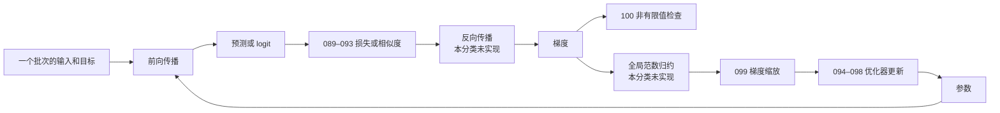

# 089–100：损失函数、优化器和训练检查

本章从一次训练迭代出发，解释 12 个 GPU 算子。089–093 计算损失或相似度，094–098 更新参数和优化器状态，099 缩放梯度，100 检查非有限值。Python 文件提供可调用的 Triton 实现；CUDA 文件提供独立的 FP32 教学对照，不是 PyTorch 扩展。

- Triton：[`python/`](./python/)
- CUDA：[`cuda/`](./cuda/)
- 测试：[`test_09_losses_optimizers.py`](../../tests/test_09_losses_optimizers.py)
- benchmark：[`benchmarks/run.py`](../../benchmarks/run.py)

## 源码地图

| 编号 | Triton | CUDA |
|---:|---|---|
| 089 | [`python/089_mse.py`](python/089_mse.py) | [`cuda/089_mse.cu`](cuda/089_mse.cu) |
| 090 | [`python/090_bce_with_logits.py`](python/090_bce_with_logits.py) | [`cuda/090_bce_with_logits.cu`](cuda/090_bce_with_logits.cu) |
| 091 | [`python/091_cross_entropy.py`](python/091_cross_entropy.py) | [`cuda/091_cross_entropy.cu`](cuda/091_cross_entropy.cu) |
| 092 | [`python/092_cosine_similarity.py`](python/092_cosine_similarity.py) | [`cuda/092_cosine_similarity.cu`](cuda/092_cosine_similarity.cu) |
| 093 | [`python/093_kl_divergence.py`](python/093_kl_divergence.py) | [`cuda/093_kl_divergence.cu`](cuda/093_kl_divergence.cu) |
| 094 | [`python/094_sgd.py`](python/094_sgd.py) | [`cuda/094_sgd.cu`](cuda/094_sgd.cu) |
| 095 | [`python/095_momentum_sgd.py`](python/095_momentum_sgd.py) | [`cuda/095_momentum_sgd.cu`](cuda/095_momentum_sgd.cu) |
| 096 | [`python/096_adam.py`](python/096_adam.py) | [`cuda/096_adam.cu`](cuda/096_adam.cu) |
| 097 | [`python/097_adamw.py`](python/097_adamw.py) | [`cuda/097_adamw.cu`](cuda/097_adamw.cu) |
| 098 | [`python/098_adagrad.py`](python/098_adagrad.py) | [`cuda/098_adagrad.cu`](cuda/098_adagrad.cu) |
| 099 | [`python/099_gradient_norm_clip.py`](python/099_gradient_norm_clip.py) | [`cuda/099_gradient_norm_clip.cu`](cuda/099_gradient_norm_clip.cu) |
| 100 | [`python/100_non_finite_check.py`](python/100_non_finite_check.py) | [`cuda/100_non_finite_check.cu`](cuda/100_non_finite_check.cu) |

## 先理解一次训练迭代

训练是用数据反复调整模型参数，使损失逐步减小的过程。下文固定使用这些名称：

- **批次（batch）**：一次送入模型的一组样本。批次维通常是张量的第一维。
- **参数（parameter）**：模型从数据中学习并跨训练迭代保存的张量，例如线性层权重。
- **前向传播（forward）**：用当前参数和一个批次的输入计算预测、logit 和损失。
- **logit**：模型在概率变换之前给出的未归一化分数。它可以是任意实数，不是概率。sigmoid 把一个 logit 转换为二分类概率；softmax 把一组 logit 转换为总和为 1 的多分类概率。
- **损失（loss）**：衡量预测与目标差异的数值。损失越小，表示当前目标下的误差通常越小。
- **反向传播（backward）**：沿计算图应用链式法则，计算损失对参数的导数。
- **梯度（gradient）**：损失对参数的导数。它描述参数发生微小变化时，损失如何变化。
- **优化器（optimizer）**：读取梯度，并按指定算法更新参数的组件。部分优化器还保存跨迭代的优化器状态。

089–093 只实现前向传播中的损失或相似度计算，不实现反向传播。094–099 接收已经计算好的梯度或范数。100 只报告张量中是否存在 NaN 或无穷大。



### 张量、形状和数据类型

张量是带有数据类型和形状的多维数组。`[rows, cols]` 表示二维张量：`rows` 是行数，`cols` 是每行元素数。连续张量按逻辑顺序存储相邻元素。本分类的 Python 包装函数要求输入位于同一个 CUDA 或 ROCm 设备、内存连续，并使用匹配的形状和数据类型。

FP16、BF16 和 FP32 分别表示 IEEE 16 位浮点数、bfloat16 和 32 位浮点数。位数较少的数据类型通常占用更少显存，但能表示的精度或范围也更有限。Triton 实现把 FP16/BF16 输入提升到 FP32 计算，再按接口约定输出 FP32 或写回原数据类型。输入已有的表示误差不会因此消失。`exp`、`log`、平方和与除法仍可能下溢、上溢或产生 NaN。

### GPU 执行名称

- **host**：运行 Python 或 C++ 控制代码的 CPU 及其内存。host 负责准备参数并启动 GPU 工作。
- **device**：执行 kernel 并保存 GPU 张量的 GPU 及其显存。把 device 上的结果立即取回 host 通常需要等待先前 GPU 工作完成，这称为 host 同步。
- **kernel**：在 GPU 上并行执行的函数。一次启动会创建许多并行执行实例。
- **CUDA thread**：CUDA 编程模型中的单个执行上下文。相邻 CUDA thread 通常处理相邻元素。
- **warp**：GPU 共同调度的一组 CUDA thread。lane 是一条 CUDA thread 在 warp 中的位置。
- **CUDA thread block（CTA）**：可以通过 shared memory 和同步屏障协作的一组 CUDA thread。shared memory 是同一个 CUDA thread block（CTA）内可见的片上存储。`__syncthreads()` 是同步屏障：所有参与的 CUDA thread 到达后才能继续。
- **CUDA grid**：一次 kernel 启动创建的全部 CUDA thread block（CTA）。
- **CUDA stream**：按顺序提交 GPU 操作的队列。同一 CUDA stream 中的操作按提交顺序执行。
- **Triton program instance**：Triton kernel 的一个独立实例。`tl.program_id(0)` 返回它在启动轴上的编号。
- **Triton block tensor**：一个 Triton program instance 同时处理的一组值。`tl.arange` 创建索引组成的 Triton block tensor。

Triton 描述一个 Triton program instance 要处理的 Triton block tensor，编译器再把工作映射到目标 GPU 的 CUDA thread 或对应的后端执行单元。因此，不应把一个 Triton program instance 等同于一个 CUDA thread。

归约（reduction）把多个值合并为更少的值，例如求和或求最大值。Triton 使用 `tl.sum` 和 `tl.max` 表达 Triton block tensor 内的归约。CUDA helper 先用 shuffle 在 warp 内交换寄存器值，再用 shared memory 合并各 warp。含 `__syncthreads()` 的 `block_sum` 或 `block_max` 必须由整个 CUDA thread block（CTA）调用；本分类的 CUDA 源码遵守该条件。

寄存器是每个执行上下文保存局部值的高速片上存储。寄存器数量有限；需求过高时，编译器可能把局部值溢出到速度更慢的内存。显存带宽表示 GPU 每秒能够搬运的全局内存数据量。若相邻 CUDA thread 访问相邻地址，硬件通常能把访问合并成较少的内存事务。

原子操作保证多个并行执行者修改同一地址时，每次读改写不可分割。本章的 atomic OR 把标志位设置为 1。无论执行多少次，最终值仍为 1。

### 优化器状态和原地更新

优化器状态是跨训练迭代保留的数据。Momentum SGD 保存速度 $v$；Adam 和 AdamW 保存一阶矩 $m$ 与二阶矩 $v$；Adagrad 保存累计平方梯度 $h$。带下划线的 094–099 API 会原地修改参数、梯度或优化器状态。原地修改表示输出写回输入所占的存储空间。

不同角色的张量不得重叠。当前 Python 包装函数检查形状、数据类型、设备和连续性，但不检查底层存储是否别名。调用方必须保证参数、梯度、速度、矩估计和其他优化器状态互不重叠。否则多个写入无法同时满足公式，部分重叠还可能引发跨 Triton program instance 的数据竞争。

## 运行教程

### 前置条件

需要 Python 3、pytest、兼容的 PyTorch 与 Triton、受支持的 NVIDIA 或 AMD GPU，以及匹配的 CUDA 或 ROCm 运行时。仓库没有提供锁定依赖的安装文件。CUDA 对照源码还需要单独的 CUDA 工具链，但本项目没有为这些文件提供统一的编译或运行入口。

下文所有命令都从项目根目录执行。项目根目录是同时包含 `README.md`、`categories/`、`tests/` 和 `benchmarks/` 的 `triton-100-ops` 目录。先进入该目录；把 `/path/to` 替换为本机路径。

```shell
cd /path/to/triton-100-ops
python3 -m pytest -q tests/test_09_losses_optimizers.py
python3 benchmarks/run.py --op 092 --check
```

pytest 命令成功时退出码为 0，摘要不包含 `failed` 或 `error`。benchmark 校验成功时先输出 `correctness=PASS`，随后输出以 `op=092` 开头的计时行。若缺少 GPU、PyTorch 或 Triton，命令会跳过或报出环境错误，不能视为 GPU 验证通过。

pytest 和 `--check` 只执行 Python/Triton 路径。它们不编译或运行 CUDA 文件。runner 测量完整调用闭包，输出时间、speedup，以及部分算子的估算带宽；它不输出 profiler 指标、实际访存事务、归约通信量或 atomic 操作次数。

## 089：Row MSE

### 概念与用途

均方误差（mean squared error，MSE）衡量连续预测与目标的平均平方距离，常用于回归和重建。本实现每行返回一个损失，不再对批次执行归约。

### 输入、输出与数学

对 `prediction[rows, cols]` 和形状相同的 `target`：

$$
L_r=\frac{1}{C}\sum_c(p_{r,c}-t_{r,c})^2.
$$

输入必须为数据类型相同、内存连续的 FP16、BF16 或 FP32 张量。输出为 `FP32[rows]`。列数必须在 1 到 65536 之间。

### 算法步骤

1. 一个 Triton program instance 或 CUDA thread block（CTA）选择一行。
2. 读取预测与目标并求差。
3. 在 FP32 中平方并按行求和。
4. 除以列数并写一个输出。

### Triton

```python
row = tl.program_id(0)
col = tl.arange(0, BLOCK)
mask = col < cols
difference = tl.load(prediction_ptr + row * cols + col, mask=mask, other=0.0).to(tl.float32)
difference -= tl.load(target_ptr + row * cols + col, mask=mask, other=0.0).to(tl.float32)
tl.store(out_ptr + row, tl.sum(difference * difference, axis=0) / cols)
```

一个 Triton program instance 处理一行。对于超出真实列数的填充逻辑元素，两路加载都返回零，所以差值也为零。

### CUDA

```cuda
float local = 0.0f;
for (int col = threadIdx.x; col < cols; col += blockDim.x) {
  const float d = prediction[row * cols + col] - target[row * cols + col];
  local += d * d;
}
const float total = block_sum(local);
if (threadIdx.x == 0) out[row] = total / cols;
```

CUDA thread 分摊列并形成局部和，整个 CUDA thread block（CTA）调用 `block_sum`。归约完成后，只有编号为 0 的 CUDA thread 写一个行结果。不能把含同步屏障的归约放进编号为 0 的 CUDA thread 分支。

### GPU硬件

同一 warp 沿列读取连续地址。短行会让部分 lane 空闲；宽行会增加归约通信和寄存器压力。每行只写一个 FP32 值，因此主要流量来自两路输入。

### 教程

从项目根目录运行：

```shell
python3 benchmarks/run.py --op 089 --check
```

看到 `correctness=PASS` 表示该用例的 Triton 行均方误差与 PyTorch 参考结果在 `rtol=atol=0.02` 下通过比较。

### 验证与限制

测试覆盖 `[7, 31]`、257 列、三种浮点数据类型和空批次。极大有限差值仍可能在 FP32 平方或求和时溢出。二维线性地址使用 32 位整数表达式；超大张量未受支持或验证。

## 090：BCE With Logits

### 概念与用途

二元交叉熵（binary cross entropy，BCE）衡量一个二分类预测与目标之间的差异。BCE With Logits 直接接收 logit，不要求调用方先计算 sigmoid。它常用于每个位置独立判断“是或否”的任务，例如多标签分类。

### 输入、输出与数学

输入 `logits` 和 `targets` 必须具有相同形状与数据类型。目标通常位于 $[0,1]$，但 Python 包装函数不检查这个范围。输出是相同形状的 FP32 张量，相当于 `reduction='none'`，即每个输入元素保留一个损失：

$$
L(x,y)=\max(x,0)-xy+\log(1+e^{-|x|}).
$$

### 算法步骤

1. 用 `max(x,0)` 和 `abs(x)` 重写朴素的 sigmoid 交叉熵。
2. 让指数参数始终不大于零。
3. 逐元素计算并直接写 FP32，不把 sigmoid 结果写成中间张量。

### Triton

```python
loss = tl.maximum(logits, 0.0) - logits * targets \
       + tl.log(1.0 + tl.exp(-tl.abs(logits)))
```

### CUDA

```cuda
out[offset] = fmaxf(value, 0.0f) - value * targets[offset] +
              log1pf(expf(-fabsf(value)));
```

CUDA 使用全局线性索引让每个 CUDA thread 处理一个元素。`log1pf` 直接计算 $\log(1+u)$，在 $u$ 很小时比先做加法再做对数更能保留有效数字。

### GPU硬件

相邻 CUDA thread 和同一个 Triton program instance 内的相邻元素访问连续地址。该算子没有归约、shared memory 或原子操作。每个元素读取两个输入并写入一个输出，同时执行绝对值、指数和对数；性能可能受显存带宽与特殊函数单元吞吐共同影响。

### 教程

从项目根目录运行：

```shell
python3 benchmarks/run.py --op 090 --check
```

看到 `correctness=PASS` 表示 benchmark 的 Triton 输出与 PyTorch `binary_cross_entropy_with_logits` 参考结果在 `rtol=atol=0.02` 下通过比较。

### 验证与限制

两端都避免指数上溢，但精度不同。CUDA `log1pf` 保留很小的 softplus 尾项。Triton 的 `log(1+u)` 可能先把 `1+u` 舍入为 1；例如正 logit 约为 20 且目标为 1 时，Triton 实现可能返回 0，而准确损失约为 $2\times10^{-9}$。

测试覆盖有限的极端 logit（±1000），但当前绝对容差不会发现该小尾项差异。NaN 和无穷大输入没有定义为可用结果。

## 091：Cross Entropy

### 概念与用途

多分类交叉熵衡量一组类别分数与正确类别之间的差异。它等于先计算 log-softmax，再选择正确类别的负对数概率。本实现融合这两步，避免写出完整的 log-softmax 中间矩阵。

### 输入、输出与数学

$$
L_r=m+\log\sum_c e^{z_{r,c}-m}-z_{r,y_r},
\qquad m=\max_c z_{r,c}.
$$

输入为 `logits[rows, classes]` 和每行一个类别标签。标签是正确类别的整数索引。输出为 `FP32[rows]`。类别数必须为 1 到 65536。减去最大 logit，可避免有限大 logit 使 `exp` 上溢。

Python 包装函数接受 int32 或 int64 标签，并在启动 kernel 前通过 GPU 归约和 `.item()` 检查范围，因此会同步 host。CUDA 接口只接受 `const int*`，即 int32；非法标签写 NaN，而 Python 包装函数抛出 `ValueError`。

### 算法步骤

1. 一行一个 Triton program instance 或 CUDA thread block（CTA）。
2. 求该行最大 logit。
3. 计算稳定的指数和与对数归一化项 `log_partition`。
4. 读取标签并选择对应 logit。
5. 写 `log_partition-selected`。

### Triton

```python
logits = tl.load(logits_ptr + row * cols + col, mask=mask, other=-float("inf")).to(tl.float32)
maximum = tl.max(logits, axis=0)
log_partition = maximum + tl.log(tl.sum(tl.exp(logits - maximum), axis=0))
label = tl.load(labels_ptr + row)
selected = tl.sum(tl.where(col == label, logits, 0.0), axis=0)
tl.store(out_ptr + row, log_partition - selected)
```

源码表达三个归约意图：最大值、指数和与标签选择求和。编译器后端可能进一步优化，但不能只凭源码断言实际同步次数。

### CUDA

```cuda
float local_maximum = -FLT_MAX;
for (int col = threadIdx.x; col < cols; col += blockDim.x)
  local_maximum = fmaxf(local_maximum, logits[row * cols + col]);
const float maximum = block_max(local_maximum);
float local_sum = 0.0f;
for (int col = threadIdx.x; col < cols; col += blockDim.x)
  local_sum += expf(logits[row * cols + col] - maximum);
const float sum = block_sum(local_sum);
```

第一遍求最大值，第二遍求稳定指数和。真实源码随后由编号为 0 的 CUDA thread 读取 int32 标签并写最终损失。两个 CUDA thread block（CTA）级归约都由整个 CUDA thread block（CTA）调用。

### GPU硬件

一行只有一个 CUDA thread block（CTA），行数决定可并行处理的行数。类别数大时，整行逻辑向量会增加寄存器压力，并可能发生寄存器溢出；CUDA 实现明确读取 logit 两遍。该实现不使用用于矩阵乘加的 Tensor Core。

### 教程

从项目根目录运行：

```shell
python3 benchmarks/run.py --op 091 --check
```

看到 `correctness=PASS` 表示 benchmark 的 Triton 输出与 PyTorch 类别索引交叉熵参考结果在 `rtol=atol=0.02` 下通过比较。

### 验证与限制

测试覆盖合法与非法标签、int64 标签、三种浮点数据类型和空批次，但不覆盖 CUDA int32 接口。整行都是 `-inf` 时，结果为 NaN。二维地址存在 32 位乘积限制。

## 092：Cosine Similarity

### 概念与用途

余弦相似度比较向量方向，而不是向量长度。它常用于嵌入（embedding）检索、对比学习和相似度打分。嵌入是把对象表示为数值向量的方法。

### 输入、输出与数学

$$
s_r=\frac{a_r\cdot b_r}
{\max(\lVert a_r\rVert_2,\varepsilon)\max(\lVert b_r\rVert_2,\varepsilon)}.
$$

输入必须是形状和数据类型相同的二维张量。输出为 `FP32[rows]`。两个范数分别与 `eps` 取最大值，与 PyTorch 语义一致。`eps` 是避免分母过小的正数。

### 算法步骤

1. 每行读取两个向量。
2. 同时构造点积、向量 A 的平方和与向量 B 的平方和。
3. 分别对三者归约。
4. 分别限制两个范数的下界，再计算比值。

### Triton

```python
dot = tl.sum(a * b, axis=0)
squared_a = tl.sum(a * a, axis=0)
squared_b = tl.sum(b * b, axis=0)
denominator = tl.maximum(tl.sqrt(squared_a), eps) * \
              tl.maximum(tl.sqrt(squared_b), eps)
```

### CUDA

```cuda
local_dot += x * y;
local_a += x * x;
local_b += y * y;
const float dot = block_sum(local_dot);
const float squared_a = block_sum(local_a);
const float squared_b = block_sum(local_b);
if (threadIdx.x == 0)
  out[row] = dot / (fmaxf(sqrtf(squared_a), eps) *
                    fmaxf(sqrtf(squared_b), eps));
```

每个 CUDA thread 持有三个局部累加器，整个 CUDA thread block（CTA）依次归约。编号为 0 的 CUDA thread 只执行最终除法和写回。三个归约增加寄存器使用和跨 warp 通信。

### GPU硬件

同一 warp 沿列读取连续地址。每个 CUDA thread 同时累积点积与两个平方和，所以寄存器需求高于单归约。三个 CUDA thread block（CTA）级归约还需要 warp shuffle、shared memory 和同步。

### 教程

从项目根目录运行：

```shell
python3 benchmarks/run.py --op 092 --check
```

看到 `correctness=PASS` 表示 benchmark 的 Triton 输出与 PyTorch `cosine_similarity` 参考结果在 `rtol=atol=0.02` 下通过比较。

### 验证与限制

当前算法直接平方。大而有限的 FP32 输入可能使平方和成为无穷大，最终出现 `Inf/Inf -> NaN`；实现没有使用缩放范数算法。测试覆盖零向量和小范数，不覆盖大值溢出。

## 093：KL Divergence

### 概念与用途

KL 散度衡量概率分布 $P$ 相对于概率分布 $Q$ 的差异，常用于知识蒸馏、变分模型和分布匹配。它不是对称距离，所以交换 $P$ 与 $Q$ 会改变结果。本实现接收 `log_p` 和 `log_q`，即对数概率，而不是普通概率。

### 输入、输出与数学

$$
D_{\mathrm{KL}}(P\|Q)=\sum_c e^{\log p_c}(\log p_c-\log q_c).
$$

输入必须是形状与数据类型相同的二维张量；输出为 `FP32[rows]`。Python 包装函数不验证每行对应的概率和是否为 1。调用方通常先执行 log-softmax，以产生归一化概率的对数。

### 算法步骤

1. 对 `log_p` 求指数，恢复 $P$ 的概率权重。
2. 计算 $P(\log P-\log Q)$。
3. 显式处理零概率边界。
4. 按行求和。

### Triton

```python
p_is_zero = log_p == -float("inf")
q_is_zero = log_q == -float("inf")
finite_log_p = tl.where(p_is_zero, 0.0, log_p)
finite_log_q = tl.where(q_is_zero, 0.0, log_q)
finite_term = tl.exp(finite_log_p) * (finite_log_p - finite_log_q)
nonzero_p_term = tl.where(q_is_zero, float("inf"), finite_term)
term = tl.where(mask & (log_p != -float("inf")), nonzero_p_term, 0.0)
```

代码显式定义 $P=0$ 时贡献为 0，以及 $P>0,Q=0$ 时贡献为正无穷，避免先产生 `0*Inf`。

### CUDA

```cuda
if (p == -CUDART_INF_F) continue;
local += q == -CUDART_INF_F ? CUDART_INF_F : expf(p) * (p - q);
const float total = block_sum(local);
if (threadIdx.x == 0) out[row] = total;
```

所有 CUDA thread 先调用 `block_sum`，之后编号为 0 的 CUDA thread 写结果。该顺序保证每个 CUDA thread 都经过归约中的同步屏障。

### GPU硬件

每个元素读取两个对数概率并执行指数运算，然后做行归约。指数和对数通常由 GPU 的特殊函数执行路径支持；它们的吞吐不同于普通加法与乘法。性能可能同时受特殊函数吞吐、显存带宽和归约通信影响。

### 教程

从项目根目录运行：

```shell
python3 benchmarks/run.py --op 093 --check
```

看到 `correctness=PASS` 表示 benchmark 的 Triton 输出与 $D_{\mathrm{KL}}(P\|Q)$ 的 PyTorch 表达式在 `rtol=atol=0.02` 下通过比较。

### 验证与限制

测试覆盖零概率边界和合法 log-softmax 输入，但不验证每行是否归一化，也不运行 CUDA。有限精度结果可能略小于零。

## 094：SGD

### 概念与用途

随机梯度下降（stochastic gradient descent，SGD）把当前梯度乘学习率，再从参数中减去。学习率控制每次参数变化的幅度。SGD 没有额外的优化器状态，是理解原地优化器和显存流量的起点。

### 输入、输出与数学

$$
\theta_i\leftarrow\theta_i-\eta g_i.
$$

`op094_sgd_` 原地修改参数并返回同一个张量。参数和梯度必须具有相同形状、数据类型和 device，且存储不得重叠。学习率必须有限且非负。Triton 提升到 FP32 计算，再写回原数据类型；CUDA 接口只支持 `float*` 指针，即 FP32。

### 算法步骤

1. 读取旧参数和只读梯度。
2. 在 FP32 中计算更新。
3. 把结果转换回参数的数据类型，并原地写回。

### Triton

```python
param = tl.load(param_ptr + offset, mask=mask).to(tl.float32)
grad = tl.load(grad_ptr + offset, mask=mask).to(tl.float32)
tl.store(param_ptr + offset, param - learning_rate * grad, mask=mask)
```

### CUDA

```cuda
const int offset = blockIdx.x * blockDim.x + threadIdx.x;
if (offset < count)
  param[offset] -= learning_rate * grad[offset];
```

`offset` 给每个 CUDA thread 唯一的参数索引。边界分支保护最后一个不完整的 CUDA thread block（CTA）。CUDA 直接在 FP32 参数上原地更新。

### GPU硬件

每个 CUDA thread 更新一个参数。连续 CUDA thread 访问连续地址。该 kernel 不使用 shared memory、归约或原子操作。每个元素读取参数和梯度，再写参数，因此大张量通常受显存带宽限制。

### 教程

从项目根目录运行：

```shell
python3 benchmarks/run.py --op 094 --check
```

看到 `correctness=PASS` 表示 benchmark 中原地更新后的参数与 PyTorch 参考表达式在 `rtol=atol=0.02` 下通过比较。

### 验证与限制

纯 kernel 对每个元素读取参数和梯度，再写参数，最低流量是 `3*nbytes`。当前 benchmark 按 `2*nbytes` 计算有效带宽，并且计时闭包先执行 `p.clone()`；clone 又读取并写入一次参数。因此，若保留当前计时边界，与之匹配的完整最低流量是 `5*nbytes`。若要报告纯 kernel 的 `3*nbytes`，必须先把 clone 移出计时闭包。

## 095：Momentum SGD

### 概念与用途

Momentum SGD 在 SGD 上增加速度（velocity）状态。速度是当前梯度与历史梯度的加权组合。新速度既成为下一次训练迭代的优化器状态，也用于当前参数更新。

### 输入、输出与数学

$$
v_t=\mu v_{t-1}+g_t,
\qquad \theta_t=\theta_{t-1}-\eta v_t.
$$

参数和速度原地改变。动量系数 `momentum` 只要求有限且非负；大于 1 的值会被接受，但通常不适合训练。

### 算法步骤

1. 读取旧参数、梯度和旧速度。
2. 计算新速度。
3. 保存新速度。
4. 用同一个新速度更新参数。

### Triton

```python
velocity = momentum * old_velocity + grad
tl.store(velocity_ptr + offset, velocity, mask=mask)
tl.store(param_ptr + offset, param - learning_rate * velocity, mask=mask)
```

### CUDA

```cuda
const int offset = blockIdx.x * blockDim.x + threadIdx.x;
if (offset >= count) return;
const float next_velocity = momentum * velocity[offset] + grad[offset];
velocity[offset] = next_velocity;
param[offset] -= learning_rate * next_velocity;
```

`next_velocity` 同时用于速度写回和参数更新，避免重新读取刚写入的速度。

### GPU硬件

每个 CUDA thread 按相同顺序更新一个参数和一个速度元素。相比 SGD，它多读取并写入一次速度，仍是顺序访问全局内存的流式 kernel。融合两个写入避免拆成两个 kernel，也避免第二个 kernel 再次读取速度。

### 教程

从项目根目录运行：

```shell
python3 benchmarks/run.py --op 095 --check
```

看到 `correctness=PASS` 表示更新后的参数和速度都与 PyTorch 参考表达式在 `rtol=atol=0.02` 下通过比较。

### 验证与限制

测试核对一次更新和三种浮点数据类型，但不测试连续多步或存储别名。

## 096：Adam

### 概念与用途

Adam 为每个参数同时跟踪梯度的指数移动平均值和梯度平方的指数移动平均值。它们分别称为一阶矩和二阶矩。偏差修正（bias correction）补偿优化器状态从零开始时，早期矩估计偏小的问题。

### 输入、输出与数学

$$
m_t=\beta_1m_{t-1}+(1-\beta_1)g_t,
\qquad v_t=\beta_2v_{t-1}+(1-\beta_2)g_t^2,
$$

$$
\theta_t=\theta_{t-1}-\eta
\frac{m_t/(1-\beta_1^t)}{\sqrt{v_t/(1-\beta_2^t)}+\varepsilon}.
$$

参数、一阶矩和二阶矩原地更新。host 先计算偏差修正。四个张量必须互不重叠。旧二阶矩应非负，但 Python 包装函数不扫描该状态。旧值为负不一定产生 NaN：kernel 会先计算新二阶矩，只有更新后的值仍为负时，`sqrt` 才产生 NaN。

`step` 表示从 1 开始的训练迭代编号。它的类型注解是 int，但实现只检查 `step < 1`。因此 1.5、True 和某些非有限值没有得到正确的类型拒绝，可能产生非标准偏差修正或 Python 异常。当前调用方必须传普通整数，并且至少为 1。

### 算法步骤

1. host 计算 $1-\beta_1^t$ 和 $1-\beta_2^t$。
2. kernel 读取参数、梯度、旧一阶矩和旧二阶矩。
3. 计算并保存两个新矩估计。
4. 用新矩估计和偏差修正计算更新量。
5. 原地写回参数。

### Triton

```python
first = beta1 * old_first + (1.0 - beta1) * grad
second = beta2 * old_second + (1.0 - beta2) * grad * grad
update = (first / correction1) / (tl.sqrt(second / correction2) + eps)
tl.store(first_ptr + offset, first, mask=mask)
tl.store(second_ptr + offset, second, mask=mask)
tl.store(param_ptr + offset, param - learning_rate * update, mask=mask)
```

### CUDA

```cuda
const float gradient = grad[offset];
const float first = beta1 * first_moment[offset] + (1.0f - beta1) * gradient;
const float second = beta2 * second_moment[offset] +
                     (1.0f - beta2) * gradient * gradient;
first_moment[offset] = first;
second_moment[offset] = second;
const float update = (first / correction1) /
                     (sqrtf(second / correction2) + eps);
param[offset] -= learning_rate * update;
```

代码先形成新矩估计，再以同一局部值计算更新量。修正系数由 host 传入，kernel 内没有幂运算。

### GPU硬件

每个 CUDA thread 负责一个参数及其两个矩估计。每个参数有四次读取和三次写入。平方根和除法增加算术成本，但大模型更新通常仍受优化器状态产生的显存流量限制。

### 教程

从项目根目录运行：

```shell
python3 benchmarks/run.py --op 096 --check
```

看到 `correctness=PASS` 表示参数、一阶矩和二阶矩都与 PyTorch 参考表达式在 `rtol=atol=0.02` 下通过比较。

### 验证与限制

测试只覆盖 `step=3` 的一次手算。它不覆盖非整数 `step`、负二阶矩、连续多步、存储别名或 CUDA。

## 097：AdamW

### 概念与用途

AdamW 在 Adam 的自适应更新之外，单独对参数应用权重衰减。权重衰减按参数大小施加收缩，常用于限制模型权重持续增大。

### 输入、输出与数学

$$
\theta_t=\theta_{t-1}-\eta\left(
\frac{\hat m_t}{\sqrt{\hat v_t}+\varepsilon}+\lambda\theta_{t-1}\right).
$$

输入与 Adam 相同，并增加非负权重衰减系数 `weight_decay`，公式中记为 $\lambda$。参数、一阶矩和二阶矩原地更新。衰减项使用旧参数，且不进入矩估计。`weight_decay` 必须有限且非负。该接口还继承 096 的非别名、非负二阶矩和 `step` 类型限制。

### 算法步骤

1. 按 Adam 公式计算新的一阶矩和二阶矩。
2. 对两个矩应用偏差修正，得到自适应更新。
3. 用旧参数计算独立的权重衰减项。
4. 把两项相加，写回矩估计与参数。

### Triton

```python
update = (first / correction1) / (tl.sqrt(second / correction2) + eps)
update += weight_decay * param
tl.store(param_ptr + offset, param - learning_rate * update, mask=mask)
```

### CUDA

```cuda
const float old_param = param[offset];
const float update = (first / correction1) /
                     (sqrtf(second / correction2) + eps) +
                     weight_decay * old_param;
param[offset] = old_param - learning_rate * update;
```

`old_param` 确保权重衰减使用更新前参数。衰减项只进入最终更新量，不进入两个矩估计。

### GPU硬件

AdamW 与 Adam 具有相同的全局张量读写次数。权重衰减只增加一次乘法和一次加法，不增加额外张量。相邻 CUDA thread 处理相邻参数；kernel 不使用 shared memory、归约或原子操作。

### 教程

从项目根目录运行：

```shell
python3 benchmarks/run.py --op 097 --check
```

看到 `correctness=PASS` 表示参数和两个矩估计都与包含独立权重衰减的 PyTorch 参考表达式在 `rtol=atol=0.02` 下通过比较。

### 验证与限制

测试核对一次 AdamW 更新，但不覆盖 `weight_decay=0` 时与 Adam 的退化关系、`step` 类型、存储别名或 CUDA。

## 098：Adagrad

### 概念与用途

Adagrad 为每个参数累积历史梯度的平方。累计值越大，当前梯度除以的分母越大。因此，经常出现梯度的参数维度会得到更小的有效学习率。

### 输入、输出与数学

$$
h_t=h_{t-1}+g_t^2,
\qquad \theta_t=\theta_{t-1}-\eta\frac{g_t}{\sqrt{h_t}+\varepsilon}.
$$

参数和累计平方梯度状态原地更新。参数更新使用新状态。状态应非负，但 Python 包装函数不验证；负状态可能产生 NaN。

### 算法步骤

1. 读取参数、梯度和旧累计平方梯度。
2. 把当前梯度的平方加入累计值。
3. 写回新的累计值。
4. 用新累计值缩放当前梯度，再原地更新参数。

### Triton

```python
state = old_state + grad * grad
tl.store(state_ptr + offset, state, mask=mask)
tl.store(param_ptr + offset,
         param - learning_rate * grad / (tl.sqrt(state) + eps), mask=mask)
```

### CUDA

```cuda
const float gradient = grad[offset];
const float next_state = state[offset] + gradient * gradient;
state[offset] = next_state;
param[offset] -= learning_rate * gradient /
                 (sqrtf(next_state) + eps);
```

`next_state` 先写入状态，也直接进入当前参数更新的分母。使用旧状态会实现另一套算法。

### GPU硬件

每个 CUDA thread 处理一个参数和一个累计值。每个元素读取参数、梯度和旧累计值，写回参数和新累计值，并执行平方根与除法。dense 实现即使梯度为零也会扫描整个张量。

### 教程

从项目根目录运行：

```shell
python3 benchmarks/run.py --op 098 --check
```

看到 `correctness=PASS` 表示参数和累计平方梯度都与 PyTorch 参考表达式在 `rtol=atol=0.02` 下通过比较。

### 验证与限制

优化器状态应为非负值，但包装函数不扫描其内容；负值可能使平方根产生 NaN。测试不覆盖负优化器状态、稀疏更新、存储别名或 CUDA。

## 099：Apply Gradient Norm Clip Scale

### 概念与用途

梯度范数裁剪把过大的梯度统一缩小，用于降低训练中更新突然变大的风险。本算子只实现裁剪的第二阶段：调用方必须先用另一个归约计算全局范数。

### 输入、输出与数学

$$
s=\min\left(1,\frac{M}{n+\varepsilon}\right),
\qquad g_i\leftarrow sg_i.
$$

输入是要原地修改的梯度、已计算的范数 `norm`、阈值 `max_norm` 和稳定常数 `eps`。公式中 $n$ 是输入范数，$M$ 是允许的最大范数，$s$ 是缩放系数。输出与输入梯度使用同一存储空间。`norm` 和 `max_norm` 必须有限且非负；`eps` 必须有限且为正。

### 算法步骤

1. 在 host 端把 `norm`、`max_norm` 和 `eps` 作为标量传入。
2. 计算不大于 1 的统一缩放系数。
3. 每个并行执行单元读取一个梯度元素。
4. 乘缩放系数并原地写回。

### Triton

```python
scale = tl.minimum(1.0, max_norm / (norm + eps))
grad = tl.load(grad_ptr + offset, mask=mask).to(tl.float32)
tl.store(grad_ptr + offset, grad * scale, mask=mask)
```

### CUDA

```cuda
const int offset = blockIdx.x * blockDim.x + threadIdx.x;
if (offset < count)
  grad[offset] *= fminf(1.0f, max_norm / (norm + eps));
```

`norm`、`max_norm` 和 `eps` 对全部 CUDA thread 都是相同的标量。每个 CUDA thread 只读写自己的梯度元素。

### GPU硬件

所有 CUDA thread 使用同一个标量缩放系数，并各自连续读写一个梯度元素。kernel 不使用归约、shared memory 或原子操作，通常受显存带宽限制。完整操作还包括上游的全局范数归约。

### 教程

从项目根目录运行：

```shell
python3 benchmarks/run.py --op 099 --check
```

看到 `correctness=PASS` 表示缩放后的梯度与使用同一个预计算范数的 PyTorch 参考表达式在 `rtol=atol=0.02` 下通过比较。

### 验证与限制

kernel 无法确认 `norm` 是否来自当前梯度。接口接收 host 浮点数；如果范数通过 GPU 张量的 `.item()` 获得，完整流水线会发生 host 同步。测试传入预先计算的范数，无法发现陈旧范数或属于另一份梯度的范数。

## 100：Non-Finite Check

### 概念与用途

非有限值是 NaN、正无穷大或负无穷大。混合精度训练使用不止一种浮点数据类型，通常用较低精度降低显存占用并提高吞吐。较窄的表示范围使溢出检查尤其重要。训练流程通常在优化器更新前检查梯度是否包含非有限值，以避免把无效结果写入参数和优化器状态。输出标志留在 device 上时，后续 GPU 工作可以直接读取它，不必立即同步 host。

### 输入、输出

`op100_non_finite_check(x)` 返回 device 上的 int32 标量。存在 NaN、正无穷大或负无穷大时返回 1，否则返回 0。

### 算法步骤

1. 创建并清零标志。
2. 每个 Triton program instance 扫描连续输入。
3. 在 Triton program instance 内归约非有限值数量。
4. 只有发现非有限值的 Triton program instance 执行一次 atomic OR。

### Triton

```python
value = tl.load(x_ptr + offset, mask=mask, other=0.0).to(tl.float32)
bad_count = tl.sum(
    tl.where(mask & ((value != value) | (tl.abs(value) == float("inf"))), 1, 0),
    axis=0,
)
tl.atomic_or(flag_ptr, 1, mask=bad_count > 0)
```

### CUDA

```cuda
cudaMemsetAsync(flag, 0, sizeof(int), stream);
const int offset = blockIdx.x * blockDim.x + threadIdx.x;
if (offset < count && !isfinite(x[offset]))
  atomicOr(flag, 1);
```

`cudaMemsetAsync` 和 kernel 位于同一个 CUDA stream，因此按提交顺序执行。CUDA 实现让每个非有限元素直接执行 atomic OR。

### GPU硬件

Triton 先在每个 Triton program instance 内归约，再由发现异常的 Triton program instance 执行一次 atomic OR。CUDA 让每个非有限元素直接执行 atomic OR。两端都先清零标志；CUDA 使用同一个 CUDA stream 中的 `cudaMemsetAsync`。

### 教程

从项目根目录运行：

```shell
python3 benchmarks/run.py --op 100 --check
```

默认 benchmark 输入全部有限。看到 `correctness=PASS` 只表示该全有限用例与 PyTorch 参考检查一致；它不会测量非有限值密度或原子竞争。

### 验证与限制

测试覆盖无穷大、NaN、全有限输入和空张量，但只执行 Triton。benchmark 只生成全有限输入，不测异常密度或 atomic 竞争。

## 验证边界

现有测试覆盖常见有限输入、257/1003尾部、三种浮点dtype、空tensor、非法标签和部分非法超参数。它没有覆盖：

- 任何 CUDA 编译或执行；
- 优化器张量的存储重叠；
- Adam 和 AdamW 的非整数 `step`；
- 负二阶矩或负 Adagrad 状态；
- 余弦相似度的大值平方溢出；
- BCE 很小的 softplus 尾项；
- 超过 32 位线性地址的二维张量。

runner 计时 Python 包装函数，而不是纯 kernel。它包含输出分配、优化器输入 clone、091 标签检查同步等工作，PyTorch 参考路径不总是承担相同成本。因此，当前 speedup 不是严格公平的 kernel 性能结论。

`--check`对所有输出统一使用 `rtol=atol=0.02`。该容差足以掩盖约 $10^{-3}$ 的优化器更新缺失，也不适合精确标志。应为每个算子和返回字段设置独立容差。

后续应先补 CUDA 编译与运行测试和存储别名拒绝，再修正 `step` 校验与数值边界，最后分别报告输入准备、合法性检查、状态复位和纯 kernel 时间。
